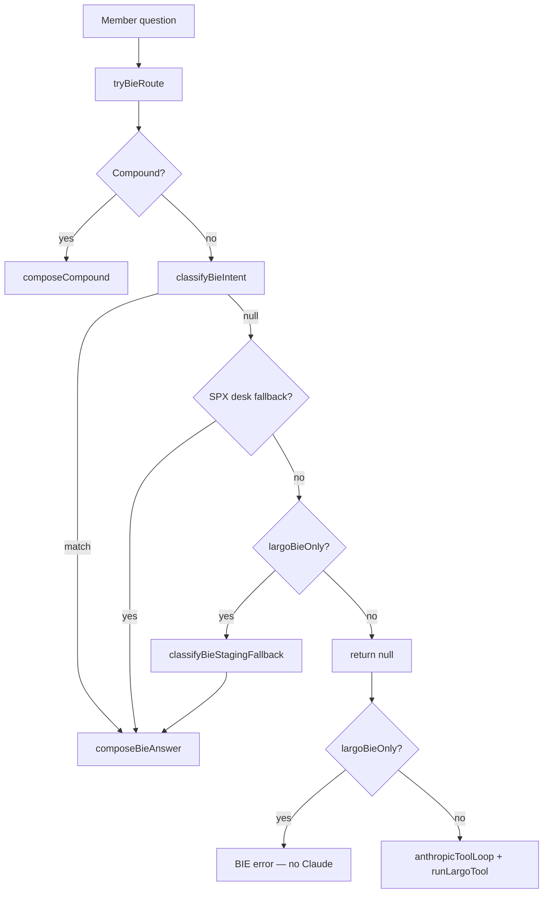

# Largo data access audit — BIE migration

Last updated: 2026-07-17. Repo: `blackout-web-sandbox`.

This document answers: **what data Largo can read today**, **what it cannot**, and **how to move Largo fully off Claude onto BIE** without inventing numbers.

---

## Executive summary

| Path | When | Cost | Data access |
|------|------|------|-------------|
| **BIE router** | Question matches a deterministic intent (~20 intents) | Zero Anthropic | Platform service readers + `loadBiePlatformContext()` |
| **BIE staging fallback** | BIE-only mode + router miss | Zero Anthropic | Same composers, broader regex |
| **Claude tool loop** | Prod default when router misses | Anthropic Sonnet + tools | Up to ~103 tools, intent-filtered subset per turn |

**Staging** is BIE-only by default (`claudeEnabled()` false unless `STAGING_CLAUDE=1`).

**Production** still falls back to Claude for unmatched or “reasoning-shaped” questions unless **`LARGO_BIE_ONLY=1`** is set on the app (ECS / Secrets Manager).

BIE is **not** a raw Redis/SQL dump. It reads through the same **platform service readers** dashboards use — numbers are traceable by construction. Claude path uses **governed tools** (`runLargoTool`) with the same readers under the hood.

---

## Request flow



Key files:

- Orchestrator: `src/lib/largo-terminal.ts`
- Router: `src/lib/bie/router.ts`
- Composers: `src/lib/bie/composers.ts`
- Platform plane: `src/lib/bie/platform-context.ts`
- Tools: `src/lib/largo/tool-defs.ts`, `src/lib/largo/run-tool.ts`
- Policy: `src/lib/ai-env.ts` (`largoBieOnly()`, `claudeEnabled()`)

---

## BIE router intents (deterministic, zero Claude)

| Intent | Example question | Primary data |
|--------|------------------|--------------|
| `spx_desk_read` | SPX setup / bias / explain | `loadMergedSpxDesk()`, intel prefetch, synthesis |
| `spx_structure` | SPX walls / gamma flip | SPX desk + GEX positioning |
| `spx_invalidation` | What kills the thesis | Confluence + invalidation lines |
| `flow_tape` | Unusual flow / whale prints | Postgres `flow_alerts`, HELIX tape readers |
| `market_context` | What is the market doing | Platform snapshot, regime, breadth |
| `vector_read` | Vector walls / flip on ticker | `fetchVectorFullState()` |
| `nighthawk_edition` | Tonight's playbook / why picked | Pinned NH edition records |
| `zerodte_plays` | 0DTE board today | `zeroDtePlaysForLargo()` |
| `ticker_play_state` | Status of ledger ticker play | 0DTE board row |
| `ticker_ecosystem` | What's going on with NVDA | Ecosystem fan-out |
| `ticker_advice` / `verdict` | Should I hold / grade this | Verdict synthesis |
| `ticker_compare` | NVDA vs AMD | Side-by-side tool fan-out |
| `cortex_read` | Why commit/skip/exit | Cortex ledger |
| `scenario` | If SPX drops 1% | Shifted Vector recompute |
| `record_read` | Track record / win rate | `buildPublicTrackRecord()` + SPX vs NH comparison |
| `concept_read` | What is GEX | Glossary |
| `universal_lookup` | Pull `/api/market/...` | `call_internal_api` allowlist |
| `system_diagnostic` | Why isn't X updating | Pipeline health readers |
| `platform_read` | Full platform / every product / all data | `bie:full-state` Redis snapshot (Thermal matrix, Vector, HELIX, NH, 0DTE, regime) |
| `compound_lookup` | Multi-part question | Parallel sub-composers |

**Router returns `null` (→ Claude on prod):**

- Length > 160 chars or > 2 sentences (unless compound path catches it)
- `REASONING_RE` (`why`, `explain`, `should I`, `what if`, …) unless a narrower branch matched first
- Out-of-scope (poems, quantum physics, …)

In **`largoBieOnly()`** mode, `classifyBieStagingFallback()` always picks an intent; last resort is `market_context`.

---

## BIE platform context (`loadBiePlatformContext`)

Single parallel fan-out used by SPX desk brief, market context, and synthesis layers.

| Field | Source | Scope |
|-------|--------|-------|
| `desk` | `loadMergedSpxDesk()` | desk / full |
| `intel` | GEX positioning + heatmap slice + NH diffs | desk / full |
| `nighthawk` | `getLatestNightHawkEdition()` | desk / full |
| `snapshot` | `getPlatformSnapshot(spx, flows, nighthawk)` | market / full |
| `regime` | `get_market_regime` tool reader | market / full |
| `cross` | open play, lotto, power hour, outcome stats | all |
| `knowledge` | Voyage `searchKnowledge()` | full + query |

Scopes: **`desk`** (hot SPX path), **`market`**, **`full`**.

Cached: `getCachedBiePlatformContext()` — 8s desk / 5s market SWR.

**Does not include by default:** full Thermal cell matrix JSON on every intent (use `platform_read` or `thermalMatrix` in `bie:full-state`), raw Redis key dumps, member watchlists, admin/cron surfaces.

### Full platform snapshot (`bie:full-state` → `platform_read`)

Cron **`bie-full-state-snapshot`** writes Redis key **`bie:full-state`** every ~5 min RTH. Largo reads it via **`getBieFullStateForLargo()`** — live rebuild when cold/stale.

| Field | Products / data |
|-------|-----------------|
| `platform` | SPX Slayer + HELIX tape + Night Hawk edition |
| `intel` | RDS regime, anomalies, signal recommendation |
| `thermalSpx/Spy/Qqq` | GEX/VEX/DEX/CHARM positioning (canonical Thermal contract) |
| `thermalMatrix` | SPX 0DTE matrix scalars + near-spot γ ladder |
| `vectorSpx` | Vector SPX 0DTE desk (walls, flip, play) |
| `vectorUniverse` | Vector wall summary rows |
| `zerodte` | 0DTE Command board |
| `regime` | HELIX regime detector |
| `marketContext` | Indices, tide, breadth |
| `hotTickers` / `darkPool` | HELIX flow leaders + dark pool |

Ask Largo: *"full platform snapshot"* or *"know in and out about every product"* → **`platform_read`** intent.

---

## Product access matrix

Legend: **BIE** = router composer path. **Tools** = Claude path only (`runLargoTool`). **API** = `call_internal_api` GET allowlist.

### SPX Slayer (`/dashboard`, play engine)

| Can read | How |
|----------|-----|
| Live desk (price, VWAP, bias, walls, confluence) | BIE `spx_desk_read`, `spx_structure`; tools `get_spx_structure`, `get_spx_confluence` |
| Open play, lotto, power hour | Platform context `cross`; tools `get_spx_play`, `get_lotto_*`, `get_power_hour` |
| Signal log (committed signals) | `get_signal_log` |
| Engine snapshot / rejection history | `get_spx_engine_snapshots` |
| Closed trade stats | `get_trade_history`, `get_setup_stats`; BIE `record_read` |
| Playbook shadow / cross-tool state | Internal readers in desk brief |

| Cannot / limited |
|------------------|
| Weekly/monthly SPX structure at wrong horizon → use **`vector_read`** (desk is 0DTE aggregate) |
| Mutations (commit play, override gates) |
| Raw UW WebSocket stream (server-side only; Largo sees persisted/cache layers) |

### HELIX (`/flows`)

| Can read | How |
|----------|-----|
| Flow tape (Postgres alerts) | BIE `flow_tape`; tools `get_flow_tape`, `get_postgres_flows` |
| Hot tickers, anomalies | `get_hot_tickers`, `get_flow_anomaly_near_misses` |
| Dark pool / lit / UW flow REST | Standard flow tools |
| Market-wide tide in snapshot | `market_context`, `get_platform_snapshot` |

| Cannot / limited |
|------------------|
| HELIX UI analytics rail scope (ticker-filtered panels) — **UI-only**, not exposed to Largo |
| Live SSE stream from browser (server has ingest; Largo queries DB/cache) |
| Polygon as primary flow source (UW WS → persist → Postgres) |

### Thermal / BlackOut Thermal (`/heatmap`)

| Can read | How |
|----------|-----|
| GEX positioning summary (flip, king, regime) | `get_positioning`; intel prefetch in platform context |
| Regime events history | `get_gex_regime_events` |
| Full matrix | `call_internal_api` → `/api/market/gex-heatmap?ticker=…` |

| Cannot / limited |
|------------------|
| No dedicated **`thermal_read`** BIE intent (use `vector_read`, `concept_read`, or internal API) |
| `get_gex` tool ≠ Thermal cache (uses SPX desk / Polygon 0DTE bundle) |
| Cell-level matrix not in default BIE platform context (only slice in SPX intel) |

### Night Hawk

| Can read | How |
|----------|-----|
| Latest edition, picks, publish context | BIE `nighthawk_edition`; tool `get_nighthawk_edition` |
| Outcomes / win rate window | `get_nighthawk_outcomes`; BIE `record_read` comparison |
| Dossier / scoring | `get_nighthawk_dossier` |
| SPX vs NH comparison | `get_spx_vs_nighthawk_comparison` |

| Cannot / limited |
|------------------|
| Live hunt synthesis (`/api/market/nighthawk/hunt`) — **denied** on internal API allowlist |
| NH edition **generation** (still uses Claude on synthesis cron — separate from Largo) |

### Vector

| Can read | How |
|----------|-----|
| Walls, flip, beads, ladder | BIE `vector_read`; tool `get_vector_full_state` |
| Scenarios (shifted spot) | BIE `scenario` |
| Bars / stream endpoints | `call_internal_api` vector routes |

| Cannot / limited |
|------------------|
| Unsupported horizons (e.g. LEAP) → honest rejection in composer |

### 0DTE Command (`/grid`)

| Can read | How |
|----------|-----|
| Today's board, fresh finds | BIE `zerodte_plays`; `get_zerodte_plays` |
| Rejections | `get_zerodte_rejections` |
| Per-ticker play state | BIE `ticker_play_state` |
| Cortex commit/skip | BIE `cortex_read` |

### Track record (public)

| Can read | How |
|----------|-----|
| SPX public aggregates | BIE `record_read` → `buildPublicTrackRecord()` |
| SPX vs NH 30d window | BIE `record_read` → `get_spx_vs_nighthawk_comparison` |
| Premium desk detail | Authenticated `/track-record` page APIs (not in anonymous BIE) |

| Cannot / limited |
|------------------|
| Per-trade rows in public BIE answer (by design — aggregate only) |
| `POST /api/track-record/publish` — mutation denied |

### Cross-platform

| Can read | How |
|----------|-----|
| Ecosystem (multi-product on one ticker) | BIE `ticker_ecosystem`; `get_ecosystem_context` |
| Platform snapshot | `get_platform_snapshot` (note: `include: "largo"` is documented no-op) |
| Confluence outcome stats | `get_confluence_outcomes` |
| Voyage precedents | `get_similar_precedents`, knowledge search |
| Governed internal GET APIs | `call_internal_api` — see `src/lib/largo/route-registry.ts` |

| Cannot / limited |
|------------------|
| Admin, cron triggers, webhooks, `largo/query` echo |
| Member-specific tier / watchlist (except live-feed context on Claude path) |
| Writes / trades / config changes |

---

## Claude tool inventory (when BIE misses)

~**103 tools** in `LARGO_TOOL_DEFS`. Intent analysis (`analyzeLargoQuestion` + `getToolsForIntent`) exposes roughly **15–40 tools per turn**.

Categories: Polygon quotes/technicals, UW flow/options, fundamentals/news, screener, SPX suite, NH suite, Thermal, Vector, cross-tool BIE tools, escape hatches (`get_uw`, `get_polygon`, `call_internal_api`).

All tools route through **`runLargoTool`** — same Postgres/Redis/service readers as the app; not ad-hoc SQL from the model.

---

## Migration plan: Largo 100% BIE (no Claude)

### Phase 1 — Ship fixes (this PR)

- [x] Wire **`record_read`** composer (was routed but returned null on main)
- [x] Expand **`record_read`** with SPX vs Night Hawk 30d comparison
- [x] **`LARGO_BIE_ONLY=1`** prod opt-in via `largoBieOnly()`
- [x] Staging fallback includes **`record_read`**
- [ ] Set `LARGO_BIE_ONLY=1` on prod ECS when ready to cut Claude spend

### Phase 2 — Router parity (no Claude needed for common prod questions)

- Relax length/sentence gates in BIE-only mode (route long questions to fallback, not null)
- Add **`thermal_read`** intent (heatmap matrix summary from `getGexPositioning` + heatmap API slice)
- Expand **`REASONING_RE` exceptions** for SPX/NH/flow when `largoBieOnly()` (already partially handled by fallback)
- Deterministic follow-ups everywhere (`bieFollowups`) — already used on BIE path; Haiku follow-ups only on Claude path

### Phase 3 — “All numerical data” without raw dumps

**Do not** feed raw Redis keys or full matrix JSON every turn — cost, latency, and verification explode.

Instead:

1. **Scoped `loadBiePlatformContext('full')`** per intent (already partial)
2. **Tool orchestration inside BIE** for unmatched compound numeric asks — e.g. internal `bieToolOrchestrator(question)` that picks 2–4 tools deterministically before composing (no LLM)
3. **Claim verification** (`verifyClaims`) on every answer — already on both paths
4. Wire **data-integrity / data-correctness cron output** into BIE diagnostic composer (see `FULL-SYSTEM-AWARENESS.md`)

### Phase 4 — Remove Claude from Largo entirely

- Default **`LARGO_BIE_ONLY=1`** on prod
- Remove `anthropicToolLoop` branch from `largo-terminal.ts` (keep Claude only for NH synthesis / play critic if still needed elsewhere)
- Delete or shrink tool-def surface used only by Claude
- `npm run validate:staging-bie` → add **`validate:largo-bie`** for prod smoke

### Env vars

| Variable | Effect |
|----------|--------|
| `STAGING_CLAUDE=1` | Re-enable Claude on staging (A/B) |
| **`LARGO_BIE_ONLY=1`** | Prod Largo never calls Anthropic |
| `ANTHROPIC_API_KEY` absent | Claude disabled globally |
| `DAILY_AI_SPEND_KILL_USD` | Spend ceiling (Claude paths) |

---

## Validation commands

```bash
npm test                    # includes record-read, router, bie tests
npm run validate:staging-bie  # staging BIE probes (commentary, Largo, flow-brief)
npx tsc --noEmit
npm run lint:brand
```

---

## Honest gaps (user ask: “every data point”)

Largo **today** can reach essentially all **member-facing numerical surfaces** through tools or BIE composers, but:

1. **Not every number on every turn** — intent routing selects a subset; full platform snapshot every question would be slow and unverifiable in one blob.
2. **UI-only state** (HELIX filter scope, chart zoom, column sort) is not in Largo context.
3. **Raw infra** (Redis keys, ECS logs, cron internals) — diagnostic intent only, not full dump.
4. **Claude still answers** open-ended prod questions until `LARGO_BIE_ONLY=1`.

The correct architecture for “all data fed dynamically” is: **router + scoped platform context + governed tool fan-out + verification** — not a single LLM context window stuffed with Redis.

See also: `docs/bie/BIE-MASTER-SPEC.md`, `docs/bie/FULL-SYSTEM-AWARENESS.md`, `docs/bie/ARCHITECTURE.md`.
