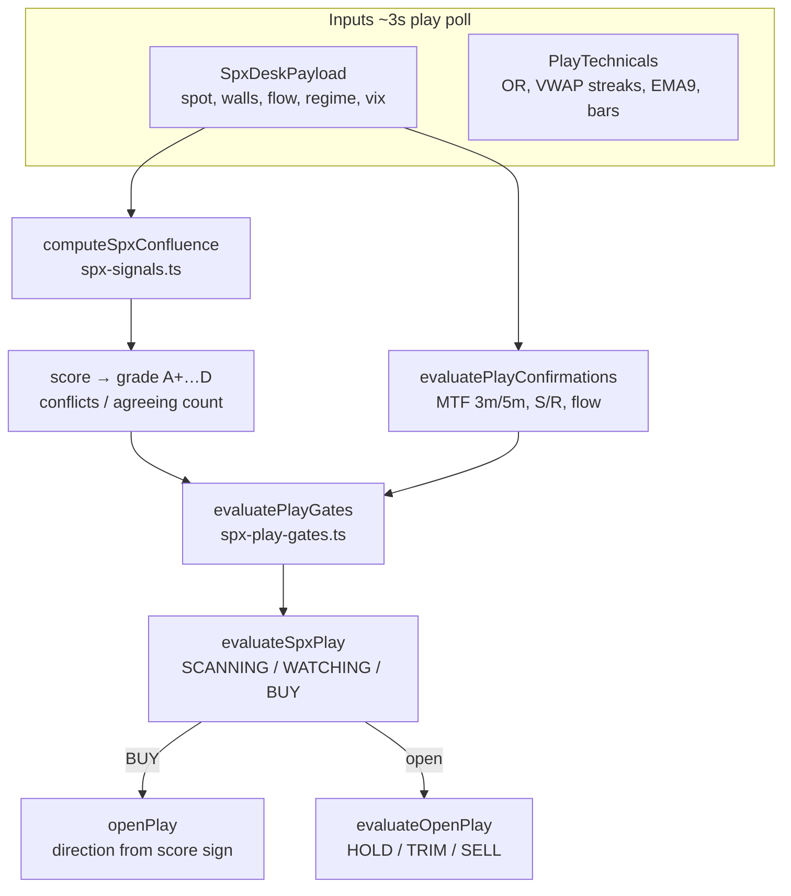
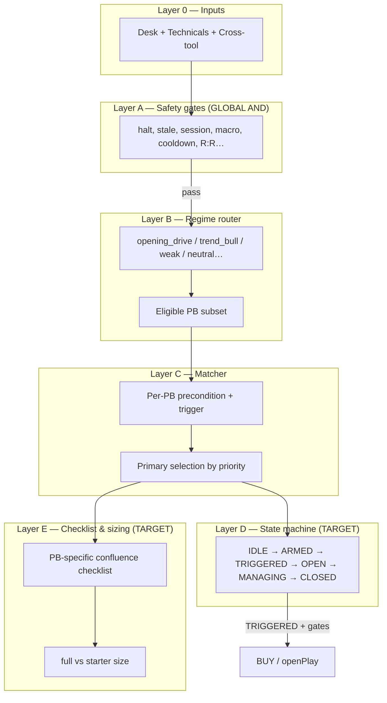
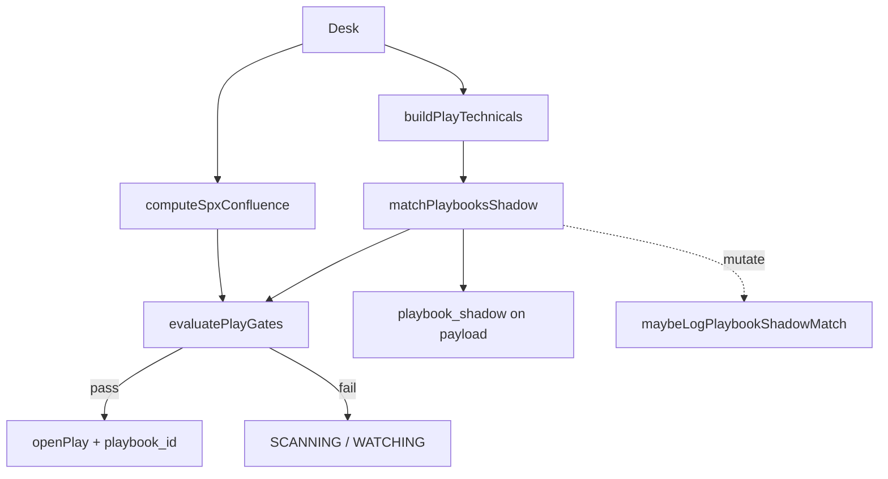

# SPX Slayer — Playbook Architecture Deep Dive

**Audience:** engineers, agents, CTO/product.  
**Repo:** `blackout-web-sandbox` (staging).  
**Last updated:** 2026-07-10.  
**Companion docs:**

| Doc | Purpose |
|-----|---------|
| `PLAYBOOK-FULL-SPEC-v2.md` | Machine-readable rules for PB-01…14, gates A1–A17, regime matrix |
| `PLAYBOOK-EVIDENCE-BASE.md` | Prod outcome mining — why we changed the model |
| `PLAYBOOK-E2E-FOUNDATION.md` | Mermaid flows, phased rollout, build-vs-gap |
| `PLAYBOOK-EXTERNAL-REVIEW-2026-07-10.md` | ChatGPT review — official response, promotion tiers, build order |
| `PLAYBOOK-CTO-BRIEF-2026-07-10.md` | Executive RTH snapshot (keep in sync after big merges) |

---

## Table of contents

1. [Executive summary](#1-executive-summary)
2. [The old architecture](#2-the-old-architecture)
3. [What went wrong — evidence from prod](#3-what-went-wrong--evidence-from-prod)
4. [Why we moved to playbook architecture](#4-why-we-moved-to-playbook-architecture)
5. [The target model — layered decision stack](#5-the-target-model--layered-decision-stack)
6. [Design ideas — the 14 playbooks](#6-design-ideas--the-14-playbooks)
7. [Implementation logic — how it runs today](#7-implementation-logic--how-it-runs-today)
8. [Trade logic — entries, management, exits](#8-trade-logic--entries-management-exits)
9. [UI & desk surfaces](#9-ui--desk-surfaces)
10. [Rollout, flags, and evidence gating](#10-rollout-flags-and-evidence-gating)
11. [What is still hybrid / open gaps](#11-what-is-still-hybrid--open-gaps)
12. [Appendix — quick reference](#12-appendix--quick-reference)

---

## 1. Executive summary

SPX Slayer started as a **global confluence scorer**: add up weighted bullish/bearish factors (VWAP, gamma, GEX walls, flow, HELIX sweeps, news, tape, etc.), map the scalar to a letter grade, pass through safety gates, and BUY when score + grade + confirmations cleared thresholds.

That model **could not explain why a trade was taken**. It repeatedly bought breakout momentum **inside a gamma pin** (mean-revert tape) and produced **long-only** entries with **grade/score that did not predict wins**.

The **playbook architecture** replaces “score alone” with **named, auditable setups** (PB-01…PB-14). Each playbook has preconditions (ARM), a trigger (FIRE), invalidation, session window, and regime eligibility. The engine still uses confluence for sizing hints and open-play management, but **BUY authority moves to playbook triggers** when the live gate is on.

**Today on staging (hybrid):**

- All **14 playbooks** evaluate every play poll via `matchPlaybooksShadow()`.
- The **Playbook terminal tab** shows live verdicts (ARM/TRIGGER per PB).
- The **legacy confluence engine** still owns BUY on prod. **Staging always runs playbook lab** — `playbookStagingLabEnabled()` is hardwired to `isStagingDeploy()` (staging URL at Docker build). No env toggle. BUY requires a fired primary playbook + aligned direction (starter sizing).
- **Telemetry** logs shadow transitions and `playbook_id` on opens for evidence.

**Target end state:** playbook-first E2E — state machine, per-playbook checklist UI, watch keys tied to playbook instances, evidence-gated promotion per PB.

---

## 2. The old architecture

### 2.1 Data flow (pre-playbook)



### 2.2 The confluence engine (“factor soup”)

`computeSpxConfluence()` in `src/features/spx/lib/spx-signals.ts` walks the desk and accumulates a **signed score** from independent factors:

| Factor family | Typical weight | What it measures |
|---------------|----------------|------------------|
| VWAP position | ±12 | Above/below session VWAP |
| Gamma regime | ±10 | Mean-revert vs amplification vs flip |
| GEX support/resistance | ±18 | Nearest wall within ~12 pts (mutually exclusive) |
| GEX king | ±6 | Distance to largest gamma node |
| 0DTE net flow | ±8–15 | `flow_0dte_net` direction + magnitude |
| HELIX sweeps | ±10–15 | Institutional SPX/SPXW sweep dominance (30m) |
| Unified tape | ±6–12 | Recent flow prints on tape |
| News keywords | −6…+3 | Macro shock headlines |
| Flow strike stacks | +3 | Repeated prints at dominant strike |
| Night Hawk prior | variable | Signed bonus from evening edition |
| Breakout flags | ±8 | HOD/LOD/VWAP reclaim from technicals |

The engine then:

1. Sums weights → **score** (e.g. 34, 58, 72).
2. Counts agreeing vs conflicting factors → **grade** (A+ requires |score|≥72 and ≤1 conflict).
3. Sets **direction** = sign of score (`long` / `short`).
4. Builds **levels** (entry=spot, stop=wall±3, target=VIX-scaled pts).

There is **no named setup**. A “BUY” means “enough factors point the same way” — not “VWAP reclaim fired” or “gamma pin fade at 7575.”

### 2.3 Gates (unchanged layer — still global AND)

`evaluatePlayGates()` applies **session and risk vetoes** before any BUY:

- Market open, halt (confirmed blocks; stale feed warns), GEX walls present, data freshness ≤90s
- Mixed tape threshold (grade-scaled), minimum grade B, macro windows (CPI/FOMC/NFP…)
- Cash open 09:30, no-entry cutoff, opening-range block until 09:50
- Score floors, buy/stop cooldowns, re-entry lock after loss, min R:R

Gates **never pick direction** — they only veto.

### 2.4 Parallel entry paths (still present)

Besides the main 0DTE structure play:

- **Lotto engine** (`spx-lotto-engine.ts`) — cheap OTM reversal runner
- **Power hour engine** (`spx-power-hour-engine.ts`) — 15:00+ momentum sleeve

These are **separate BUY paths**, not yet folded into the playbook registry. Open decision: merge into PB-08/PB-12 or keep parallel with playbook shadow overlay.

### 2.5 Watch / promote model

- **Watch key:** `0dte:{direction}:{session_date}` — one watch per direction per day, **not** per setup.
- **WATCHING** near-miss: high grade, score within ~12 of full min, most confirmations pass.
- **WATCH→ENTRY promote:** relaxed gate strip (no buy cooldown, mixed-tape bypass for A-grade) when price holds level + hard MTF pass + flow aligned.

### 2.6 What members saw

- Trade Alerts: SCANNING / WATCHING / BUY with grade + factor list
- Confluence panel: weighted factor soup (same for every potential trade)
- No “which setup is this?” beyond free-text thesis from `buildPlayIdeaIntel()`

---

## 3. What went wrong — evidence from prod

Full SQL and tables: `PLAYBOOK-EVIDENCE-BASE.md`. Summary from **19 closed outcomes** (2026-06-29 → 2026-07-06):

| Metric | Value | Implication |
|--------|-------|-------------|
| Win rate | 6W / 13L (31.6%) | Scalar confluence alone insufficient |
| A+ wins | 1/4 | Grade does not predict |
| A wins | 1/6 | Same |
| B wins | 4/9 | Best bucket still <50% |
| All 19 plays LONG | 0 shorts | Direction from score sign → bull bias |
| STOP exits | 4, avg **−8.25 pts** | Stops gapped through; worse than planned distance |
| THESIS exits | 15, avg +1.05 pts | Winners exited on thesis, not target |
| Winner MAE | ≤0.9 pts | Good entries never went against us — bad entries were wrong *setup*, not bad luck |
| 18/19 entries in `mean_revert` γ | at entry | Engine bought **breakout momentum inside a pin** |
| 13:00–14:00 ET | 5 plays, avg −2.05 | Lunch chop inside pin — worst hour band |
| 14:00+ ET | 4 plays, avg +2.05 | Only net-positive band |

### Root cause narrative

1. **No setup identity** — the engine could not say “this was a pin fade” vs “this was a VWAP reclaim.” Post-trade review was factor archaeology, not playbook attribution.
2. **Wrong playbook for the tape** — mean-revert gamma days need **fade-at-wall** (PB-04), not **breakout continuation** (implicit in high bullish score).
3. **Score ≠ edge** — two 100-score A+ plays lost. The scalar mixed independent signals without requiring a **coherent trigger**.
4. **Long monoculture** — bearish factors rarely overcame bullish structural bias in the scorer; PB-02 and short sides of dual-direction playbooks were never exercised.
5. **Stop-shaped losses** — planned ~3–5 pt stops became −8.25 avg on STOP exits (slippage/gap). Entries that immediately trade against thesis hit stops; thesis-shaped wins suggest **entry selection** is the lever, not wider stops.

These findings directly drove PB-04, PB-08, regime routing, and the `PLAYBOOK_LIVE_GATE` design.

---

## 4. Why we moved to playbook architecture

### 4.1 Design goals

| Goal | Old model | Playbook model |
|------|-----------|----------------|
| Explainability | “Score 58, grade A, 7/9 factors” | “PB-04 Gamma Pin Fade TRIGGERED long at 7575 wall” |
| Regime fit | One scorer all day | Router picks eligible PBs per tape (trend vs chop vs open drive) |
| Evidence | `spx_play_outcomes` without `playbook_id` meaning | Per-PB shadow log → outcome join → promote/demote |
| Direction | Score sign | PB trigger declares long/short per setup rules |
| UI | Generic confluence soup | Playbook tab = catalog; Play tab = trade runway for selected play |
| Safety | Global gates | Global gates **plus** setup-specific invalidation |

### 4.2 Core decision rule (target)

```text
BUY  ⇔  primary_playbook.trigger_fired == true
      AND  safety_gates.pass == true
      AND  playbook_direction == engine_direction (when live gate on)
      AND  (future) playbook checklist complete

NOT:  confluence_score >= threshold alone
```

Confluence becomes **informative** (sizing, narrative, open-play thesis break) — not the sole BUY key.

### 4.3 Shadow-first rollout (why not flip live immediately)

- 14 playbooks × ~5–8 plays/week = **months** to get `MIN_EVIDENCE=10` outcomes **per** playbook.
- Shadow mode logs every PB verdict every poll without risking capital on unproven matchers.
- Staging **playbook lab** enables live-gate BUY with **starter sizing** and advisory confirmations before prod default-on.

---

## 5. The target model — layered decision stack

### 5.1 Five layers



### 5.2 AND vs OR discipline

**Hard AND (must all pass for new BUY):**

- Layer A safety gates
- Layer B regime eligible + session window open
- Layer C trigger fired for **one** primary playbook
- (Target) Layer E checklist for that PB only

**Soft OR (inform only — never sole BUY key):**

- Legacy confluence score / grade
- Largo BIE narrative
- Night Hawk prior edition bias
- Non-primary triggered playbooks (logged, not acted)

### 5.3 Calls vs puts

Not separate playbooks. **Direction is an output** of the matched playbook:

- PB-01 reclaim above VWAP → long; reclaim below → short
- PB-02 is short-only (VWAP reject)
- PB-04 fades **away** from the touched wall

Option ticket (strike/side) follows engine direction + structure proximity.

### 5.4 Primary selection & conflicts

When multiple playbooks fire on one tick, **explicit priority** (not registry order):

```text
PB-09 > PB-13 > PB-14 > PB-03 > PB-05 > PB-06 > PB-04 > PB-07 > PB-08
  > PB-01 > PB-02 > PB-10 > PB-11 > PB-12
```

Rationale: event-driven (HELIX surge) and structure-specific (failed break, ORB) beat generic VWAP/EMA patterns; lotto reversal is always last.

Known mutual exclusions:

- **PB-04 pin fade vs PB-05 wall break** — pin requires mean-revert + no breakout; break requires m3 close through wall.
- **PB-13 gap fade vs PB-03 ORB go** — gap continuation delegated to PB-03; PB-13 only fades.
- **PB-01 vs PB-02** — separated by regime router (trend_bull vs weak).

---

## 6. Design ideas — the 14 playbooks

### 6.1 Session coverage map

| Phase (ET) | Playbooks |
|------------|-----------|
| 09:30–09:45 | PB-13 forming (gap), PB-03 forming (OR) |
| 09:35–10:30 | PB-03 ORB, PB-13 gap fade, PB-14 failed break |
| 09:45–14:00 | PB-01 VWAP reclaim, PB-05/06/10 trend |
| 10:00–15:00 | PB-02 VWAP reject (weak tape) |
| 11:00–15:00 | PB-04 gamma pin fade, PB-11 range scalp |
| 14:00–15:45 | PB-07 max pain gravitation |
| 15:00–15:55 | PB-08 power hour momentum |
| Any RTH | PB-09 HELIX surge, PB-12 lotto reversal |

### 6.2 Catalog summary

| ID | Name | Direction | Regime / idea |
|----|------|-----------|---------------|
| PB-01 | VWAP Reclaim | either | Trend/recovery — reclaim after ≥15m below VWAP |
| PB-02 | VWAP Reject | short | Weak/distribution — fade rallies into VWAP |
| PB-03 | Opening Range Breakout | either | Opening drive — OR break with flow; suppress on mean-revert pin |
| PB-04 | Gamma Pin Fade | either | **[EV]** Fade wall touches inside mean-revert pin (11:30–15:00) |
| PB-05 | Wall Break Continuation | either | Vol expansion — close through wall + accelerating flow |
| PB-06 | Flip Level Ride | either | Trend — break gamma flip with EMA alignment |
| PB-07 | Max Pain Gravitation | either | Expiry — charm proxy pull toward max pain after 14:00 |
| PB-08 | Power Hour Momentum | either | **[EV]** 15:00–15:55 dominant flow + HOD/LOD break |
| PB-09 | HELIX Flow Surge | either | Event — ≥$1M sweep follow-through within 2 polls |
| PB-10 | EMA Stack Pullback | either | Trend — pullback to EMA9 in aligned stack |
| PB-11 | Range Chop Scalp | either | Neutral chop — fade 30m range edges |
| PB-12 | Lotto Reversal | either | Extreme extension fade — half size always |
| PB-13 | Gap Fade | either | **New** — gap ≥0.3% that fails to extend in first 15m |
| PB-14 | Failed Breakout Reversal | either | **New** — OR break fails, re-entry + flow flip |

**[EV]** = calibration tied to prod evidence base.

### 6.3 Why PB-13 and PB-14 were added (original catalog had 12)

- **PB-13 Gap Fade / Gap-and-Go:** Gap handling was only a `gap_pct` info field. 0DTE gap fill vs gap continuation is a distinct, high-frequency open setup with its own invalidation (breakaway gap).
- **PB-14 Failed Breakout Reversal:** ORB fail (break one side, re-enter, break other) is a reliable 0DTE reversal — mirror trade of PB-03, not the same as PB-03 invalidation.

### 6.4 Deliberately NOT added

| Pattern | Why rejected |
|---------|--------------|
| Halt-reopen momentum | Halts are hard gate (`shouldBlockForTradingHalt`); trading reopen is policy change |
| Macro-release momentum | Macro windows hard-blocked; post-window trend caught by PB-05/06/08 |
| Overnight / AH plays | Engine RTH-only by design |
| VIX inversion hedge | Portfolio posture, not 0DTE scalp |

**Cap at 14:** breadth without per-PB evidence = untested rules gating real money. New patterns must merge/replace an existing PB.

### 6.6 Matcher fidelity tiers (reconciles FULL-SPEC §3 vs §8)

| Tier | Playbooks | Meaning |
|------|-----------|---------------|
| **Shadow matcher** | PB-01…14 | `matchPlaybooksShadow()` runs every poll; Playbook tab + telemetry |
| **Full-spec fidelity** | PB-01–04, PB-08 | Evidence-backed; matcher matches FULL-SPEC without `[NEEDS-FIELD]` gaps |
| **MVP matcher** | PB-05–07, 09–14 | Matcher shipped with simplified preconditions (FULL-SPEC §3 `*spec*`) |

§3 `*implemented*` vs `*spec*` describes **rule fidelity**, not whether code exists. All 14 have matcher functions; only 01–04 and 08 are promotion-grade for evidence gating.

### 6.7 Staging policy — playbook lab always on

**By design, not a footgun:** `staging.blackouttrades.com` exists to prove playbook-gated BUY before prod. `playbookStagingLabEnabled()` returns true whenever `NEXT_PUBLIC_SITE_URL` contains `staging.` (baked in `ecr-push-staging.yml`). There is no `STAGING_PLAYBOOK_LAB=0` off switch — staging without playbook lab would duplicate prod and waste the environment.

Prod enables the same gate only via explicit `PLAYBOOK_LIVE_GATE=1`.

### 6.5 Per-playbook rule format (see FULL-SPEC for field-level detail)

Each PB follows:

```text
PRECONDITION  →  ARMED   (regime + window + setup geometry)
TRIGGER       →  FIRED   (bar/flow confirmation)
INVALIDATION  →  DISARM  (thesis broken before/after entry)
TARGET/STOP   →  levels from walls, OR width, max pain, VIX-scaled
```

Matcher MVP fallbacks where desk lacks fields (`[NEEDS-FIELD]` in FULL-SPEC):

- PB-05: drops VEX streak pre — simple wall proximity
- PB-12: uses session `spx_change_pct` proxy for 15m rolling change
- PB-14: re-entry inside OR + flow flip — no break memory struct yet

---

## 7. Implementation logic — how it runs today

### 7.1 File map

| Module | Role |
|--------|------|
| `playbook-registry.ts` | PB-01…14 definitions (name, strings, session windows) |
| `playbook-regime-router.ts` | `isPlaybookEligible(id, regimeBucket)` |
| `playbook-shadow-matcher.ts` | `matchPlaybooksShadow()` — all 14 matchers + primary pick |
| `playbook-shadow-panel.ts` | UI/API snapshot `buildPlaybookShadowPanel()` |
| `playbook-shadow-log.ts` | `maybeLogPlaybookShadowMatch()` — Postgres telemetry |
| `spx-play-engine.ts` | `evaluateSpxPlay()` — calls matcher in `evaluateFlatPlay()` |
| `spx-play-gates.ts` | Gate A17: playbook live gate on BUY |
| `spx-play-config.ts` | `playbookLiveGateEnabled()`, `playbookStagingLabEnabled()` |
| `spx-signals.ts` | Legacy `computeSpxConfluence()` — still runs every tick |
| `spx-play-technicals.ts` | OR, VWAP streaks, EMA9 curl, breakout flags |
| `spx-play-terminal-lines.ts` | Playbook tab + Play tab terminal copy |
| `SpxDeskTerminal.tsx` | Playbook vs Play tabs |
| `SpxTradeAlerts.tsx` | Kanban chips, play selection → Play tab |

### 7.2 Matcher algorithm (every play poll)

```text
1. Build PlayTechnicals from desk bars (if unavailable → panel null)
2. For each PB in PLAYBOOK_REGISTRY:
   a. session_window_open?  (ET half-open window)
   b. regime_eligible?      (playbook-regime-router)
   c. matchPbXX()           → precondition_match, trigger_fired, direction, detail
3. primary_playbook_id = first trigger_fired in PRIMARY_PRIORITY order
4. Return { verdicts[], primary_playbook_id }
```

**Stateless approximation:** ARMED ≈ `precondition_match`, TRIGGERED ≈ `trigger_fired` recomputed each tick. Durable state machine (`playbook-state.ts`) is not built yet.

### 7.3 Engine integration (`evaluateFlatPlay`)



Key variables in flat path:

- `playbookPrimaryId` — from matcher
- `playbookPrimaryDirection` — from primary verdict
- `playbookLabActive` — staging lab + direction aligns with confluence direction
- `gatePlaybookOpts` — passed into `evaluatePlayGates` for A17

### 7.4 Gate A17 — playbook live gate

In `evaluatePlayGates()` when `buyIntent && playbookLiveGateEnabled()`:

- If `playbook_primary_id == null` → block: “No playbook trigger…”
- If `playbookStagingLabEnabled()` and primary aligns → warnings, starter entry path, advisory confirmations

**Flag matrix:**

| Env | Where | Effect |
|-----|-------|--------|
| `isStagingDeploy()` (staging URL at build) | staging | **Always** playbook lab + live gate — hardwired |
| `PLAYBOOK_LIVE_GATE=1` | prod (explicit) | Forces live gate on prod |
| Neither | prod default | Shadow only — legacy score path for BUY |

### 7.5 Telemetry

| Table / signal | Content |
|----------------|---------|
| `spx_playbook_shadow_observations` | Per-PB state transitions (throttled) |
| `spx_open_play.playbook_id` | PB on entry (when set) |
| `spx_play_outcomes.playbook_id` | PB on close for evidence join |
| Signal log `playbook_pb_XX_match` | Factor-style shadow factors |

Validation: `npm run validate:staging-playbook`, `npm run validate:staging-desk-live`.

### 7.6 Poll cadence (staging, post Jul-10)

| Surface | Interval |
|---------|----------|
| Play engine (client + server cache) | ~2s |
| GEX matrix (SPX 0DTE) | 6s RTH |
| Full desk bundle | 8s |
| Chain quote for open chips | 4s (`SPX_CHAIN_QUOTE_TTL_MS`) |
| SSE spot | 250ms |

---

## 8. Trade logic — entries, management, exits

### 8.1 Entry paths (flat → open)

| Path | How it fires | Playbook interaction |
|------|--------------|---------------------|
| **Cold BUY** | Gates pass + score ≥ full min + confirmations | Blocked on live gate without primary PB |
| **WATCH→ENTRY promote** | Prior watch record + level hold + hard MTF + flow | Strips some cooldown blocks; still needs gates |
| **Playbook lab (staging)** | Primary PB fired + direction match | Starter entry; confirmations advisory |

`openPlay()` records `playbook_id` when primary is set. Option ticket built from structure proximity + live chain (`quoteSpxOdteContract()`).

### 8.2 Open play management (`evaluateOpenPlay`)

Priority order for exits:

1. **THETA** — force flat at session cutoff (~15:50 ET)
2. **SESSION** — market closed with open runner
3. **STOP** — price through stop (wall±3 or LOD/VWAP fallback)
4. **TARGET** — VIX-scaled target hit
5. **TRAIL** — after MFE thresholds: breakeven lock (+8 pts), then trail window (+15 MFE, VIX-scaled window)
6. **TRIM** — MFE ≥ dynamic trim pts AND progress ≥70% to target (once per play)
7. **THESIS** — confluence score breaks vs entry score (with MFE/time guards)

**Staleness guard:** if desk age > `SPX_PLAY_GEX_STALE_MAX_SEC`, price-driven exits suppressed (hold until fresh quote).

### 8.3 Play tab terminal — trade runway

When a kanban play is selected (`SpxTradeAlerts` → Play tab):

```text
TRADE RUNWAY
  ★ HOLD  — thesis intact, defend invalidation
  TRIM    — MFE/progress trim zone active
  SELL    — stop/target/trail/thesis/theta/session
```

`buildPlayTerminalLines()` merges:

- Selected play chip (structure / lotto / power)
- Live `option_ticket.mid` → `7400C @ 5.2` chain line
- Stage glyphs from play phase
- Playbook primary context (informational in shadow mode)

**Playbook tab** stays PB-only — 14 verdicts, no HOLD/TRIM/SELL runway.

### 8.4 Levels & R:R

- **Stop:** GEX wall ±3 pts (long below support, short above resistance)
- **Target:** `playDynamicTargetPts(vix)` — scales with expected range
- **Invalidation string:** human-readable from levels + playbook detail
- **Min R:R gate:** stop distance vs target distance in `evaluatePlayGates`

### 8.5 Sizing (current + target)

| Condition | Size today | Target (Layer E) |
|-----------|------------|------------------|
| Full gates + grade/score thresholds | full | checklist 100% + grade ≥ A |
| Starter path / playbook lab | starter | checklist ≥80% + grade ≥ B |
| PB-11, PB-12 | — | always starter cap |

**[EV]** Grade alone must never size up (A+ was 1/4 in track record).

---

## 9. UI & desk surfaces

| Surface | Shows | Does not |
|---------|-------|----------|
| **Playbook terminal tab** | All 14 PBs: ARM/TRIGGER, regime, detail, primary ★ | Trade runway, option ticket |
| **Play terminal tab** | Selected play HOLD/TRIM/SELL, chain line, structure thesis | Full PB catalog |
| **Largo BIE column** | `PLAYBOOK` commentary line naming primary shadow setup | — |
| **Kanban chips** | Open/watch labels `7400C @ 5.2` via live Polygon quote | Raw `60710C` contract codes |
| **Trade Alerts** | WATCH / OPEN lanes; click → Play tab | — |

Member messaging in shadow mode: playbook panel `mode: "shadow"` — informational until evidence promotes live gate on prod.

---

## 10. Rollout, flags, and evidence gating

### 10.1 Phases

| Phase | Deliverable | Status (staging) |
|-------|-------------|------------------|
| 1 | Shadow matcher + telemetry table | ✅ |
| 2 | ARM UI, kanban hints, Playbook terminal | ✅ |
| 2b | Regime router + bar-fidelity OR/VWAP | ✅ |
| 3 | `PLAYBOOK_LIVE_GATE` + gate A17 | ✅ (staging lab on) |
| 4 | `playbook_id` on open/outcome | ✅ |
| 5 | Durable state machine | 🔲 next |
| 6 | PB checklist replaces global soup in UI | 🔲 |
| 7 | Watch key = playbook instance | 🔲 |
| 8 | Per-PB evidence promotion (progressive tiers) | 🔲 |

See `PLAYBOOK-EXTERNAL-REVIEW-2026-07-10.md` for research → staging → limited-live criteria (replaces n=10 / WR≥45%).

### 10.2 Promotion rule (per playbook)

Progressive tiers — **not** n=10 / WR≥45%:

| Tier | Minimum bar |
|------|-------------|
| Research-qualified | ≥30 triggers, ≥20 simulated trades, multi-regime days |
| Staging-qualified | ≥50–75 prospective trades, cost-adjusted positive expectancy |
| Limited-live (prod) | Min-size + session risk governor + option quote reconciliation |

Initial live allowlist when gating expands: **PB-01, 02, 03, 04** only until state machine ships; then **PB-14**. PB-05–07, 09–13 remain shadow-only.

Full response to external review: `PLAYBOOK-EXTERNAL-REVIEW-2026-07-10.md`.

### 10.3 Weekly ops

1. Run evidence SQL (`PLAYBOOK-EVIDENCE-BASE.md`)
2. `npm run validate:staging-playbook` on RTH days
3. Join `spx_playbook_shadow_observations` ↔ `spx_play_outcomes`
4. Tighten matcher / windows if shadow disagrees with good manual trades

---

## 11. What is still hybrid / open gaps

| Item | Today | Target |
|------|-------|--------|
| BUY authority | Legacy score owns prod; staging lab owns staging | Playbook trigger default everywhere |
| Confluence UI | Global factor soup | Per-primary checklist |
| Watch identity | `0dte:{dir}:{date}` | `{pb_id}:{dir}:{instance}` |
| State machine | Stateless recompute | Persisted IDLE→CLOSED |
| Lotto / power hour | Parallel engines | Fold into PB-08/PB-12 or document as sleeves |
| `[NEEDS-FIELD]` pres | MVP fallbacks in matcher | Bar metrics: wall streak, 15m change, break memory |
| E2E FOUNDATION doc | Said PB-04–12 not built | **Update:** all 14 matchers ship on staging |

---

## 12. Appendix — quick reference

### A. Global safety gates (A1–A17)

See `PLAYBOOK-FULL-SPEC-v2.md` §1. Highlights:

- A1–A16: session, halt, stale, mixed tape, grade, macro, OR window, score, cooldowns, R:R
- **A17:** `primary_playbook_id != null` when `PLAYBOOK_LIVE_GATE` on

### B. Regime buckets

| Bucket | Source |
|--------|--------|
| `opening_drive` | 09:30–10:30 ET clock override |
| `trend_bull` / `trend_bear` | `desk.regime` |
| `recovery` / `weak` / `neutral` | `desk.regime` |
| `unknown` | missing — fail-open (all PBs eligible) |

### C. Staging build (playbook lab is implicit)

Staging images always bake `NEXT_PUBLIC_SITE_URL=https://staging.blackouttrades.com` — that alone enables playbook lab. Optional ECS keys (`PLAYBOOK_LIVE_GATE`, `STAGING_PLAYBOOK_LAB`) in infra are redundant documentation; code does not read them for the on/off decision on staging.

### D. Validation commands

```bash
npm run validate:staging-playbook
npm run validate:staging-desk-live
npm test -- src/features/spx/lib/playbook-shadow-matcher.test.ts
npm test -- src/features/spx/lib/playbook-regime-router.test.ts
```

### E. Related PRs (staging, Jul 2026)

- PB-only Playbook terminal + Vector side rail
- Human open chip labels + live chain premiums
- Play tab runway restore + faster desk polls
- Cron-auth fixes for validation scripts

---

*This document is the narrative source of truth for the playbook migration. When code and prose diverge, fix the code or update this file in the same PR.*
