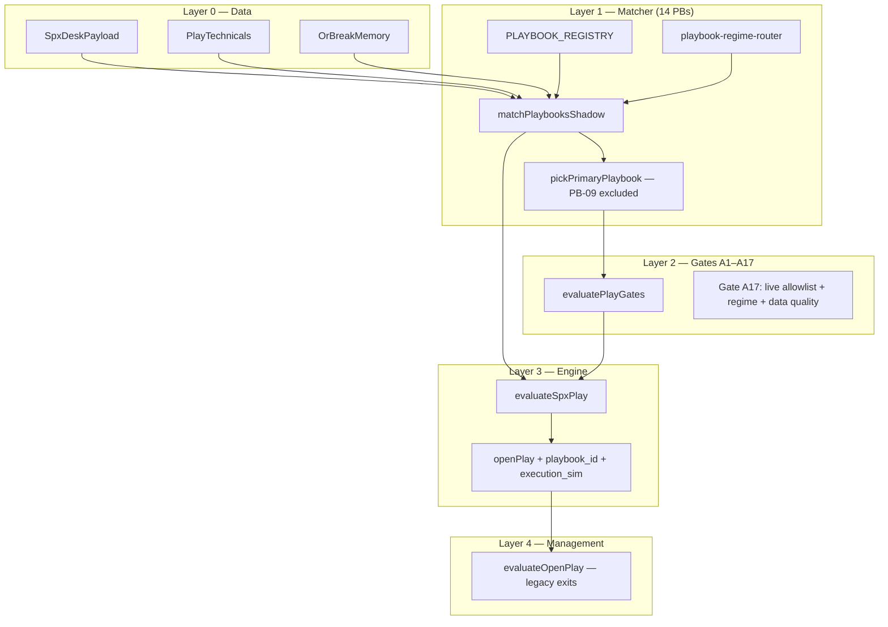

# SPX Playbook — Architecture & Status (Single Source of Truth)

**Repo:** `coreentryadmin-web/blackout-web-sandbox` → `https://staging.blackouttrades.com`  
**Last updated:** 2026-07-11  
**Scope:** Staging playbook lab only — do **not** merge to Railway prod `blackout-web` `main` unless explicitly requested.

This document consolidates architecture, implementation status, per-playbook fidelity, four setup families, what is fixed, what remains, validation tiers, and code map. Older docs (`PLAYBOOK-ARCHITECTURE-DEEP-DIVE.md`, `PLAYBOOK-IMPLEMENTATION-ROADMAP.md`, etc.) remain as detail appendices; **start here** for current truth.

---

## Table of contents

1. [Executive summary](#1-executive-summary)
2. [Architecture — layered decision stack](#2-architecture--layered-decision-stack)
   - [Operating assumptions](#21-operating-assumptions)
3. [Four setup families](#3-four-setup-families)
   - [Hierarchical research taxonomy](#31-hierarchical-research-taxonomy)
   - [Implementation status vocabulary](#32-implementation-status-vocabulary)
4. [What changed from the old model](#4-what-changed-from-the-old-model)
5. [Runtime flow (today)](#5-runtime-flow-today)
6. [Per-playbook status matrix](#6-per-playbook-status-matrix)
   - [Playbook-specific positions](#61-playbook-specific-positions-today)
7. [Shipped fixes (PR trail)](#7-shipped-fixes-pr-trail)
8. [Open gaps & phase plan](#8-open-gaps--phase-plan)
9. [Gates, flags, and live allowlist](#9-gates-flags-and-live-allowlist)
10. [Telemetry & evidence promotion](#10-telemetry--evidence-promotion)
11. [External assessment scores](#11-external-assessment-scores)
12. [ChatGPT Findings Addendum](#12-chatgpt-findings-addendum)
13. [Data & research requirements](#13-data--research-requirements)
14. [Instance schema — 20 required fields](#14-instance-schema--20-required-fields)
15. [Expectancy metrics (not win rate alone)](#15-expectancy-metrics-not-win-rate-alone)
16. [Hard constants — OOS validation bands](#16-hard-constants--oos-validation-bands)
17. [Code map](#17-code-map)
18. [Validation commands](#18-validation-commands)
19. [Related docs](#19-related-docs)
20. [Final assessment](#20-final-assessment)

---

## 1. Executive summary

| Dimension | Status |
|-----------|--------|
| **Model** | Playbook-first BUY on staging (14 named setups PB-01…PB-14) replacing opaque confluence score |
| **Staging deploy** | Playbook lab **hardwired** via `isStagingDeploy()` — live gate always on |
| **Live allowlist** | PB-01, PB-02, PB-03 only (`PLAYBOOK_PAPER_EXECUTABLE_DEFAULT`) — PB-04 **shadow** (mvp matcher) |
| **Execution modes** | `shadow` → `paper_executable` → `limited_live` → `production` per registry |
| **Prod Railway** | Legacy confluence BUY unless `PLAYBOOK_LIVE_GATE=1` (off) |
| **Primary selection** | Evidence-aware composite score (#74); static priority tie-break only |
| **State machine** | Matcher FSM `implemented`; trade FSM `implemented`; blocked-while-armed ordering `partial` |
| **Evidence** | n=19 prod outcomes mined; autonomous prod BUY frozen until tier thresholds |

**Bottom line:** Staging is the evidence lab. Architecture is promising; **trading edge remains unproven**. Families are a **hierarchical research rollup**, not proof that playbooks share one return process. Aggregate outcomes at **structural subtype** or **playbook** level before family-level claims. PB-09 demoted. Unknown regime and severe data quality fail-closed on live BUY.

> **Critical takeaway:** Do not interpret the sophistication of the architecture as evidence that the strategy works. The architecture enables falsifiable hypotheses; profitability requires clean prospective evidence, execution realism, and risk controls.

> **Honest one-line assessment (2026-07-11):** The system is well designed enough to discover whether an edge exists, but not yet tight enough to guarantee that collected evidence represents clean, independent, executable 0DTE trades. Next phase: lifecycle hygiene, execution simulation fidelity, and evidence-unit correctness — not more strategy intelligence.

---

## 2. Architecture — layered decision stack



### Layer responsibilities

| Layer | Owns | Does not own |
|-------|------|--------------|
| **Matcher** | Preconditions (ARM), triggers (FIRE), direction, session window, regime eligibility | Position sizing, exits |
| **Gates** | Session/risk vetoes, macro windows, halt, grade floors, **A17 playbook live gate** | Direction pick |
| **Engine** | BUY/SCANNING/WATCHING, confluence score (legacy), open play lifecycle | Per-PB invalidation after entry |
| **Management** | STOP/TARGET/TRIM/THESIS/THETA | Named setup identity on exit |

### Gate categories (post-hoc labels today)

`blocks_by_category` on `PlayGateResult`: `operational`, `risk`, `validity`, `quality`. Evaluation is still flat AND — **split evaluation order is phase 2**.

### Data quality modes (live gate)

| Mode | Condition | Live BUY effect |
|------|-----------|-----------------|
| `normal` | All feeds fresh | Standard per-PB rules |
| `degraded` | 1 issue (halt stale **or** desk stale **or** gex missing) | Event/breakout PBs blocked (PB-03,05,09,13,14) |
| `severe` | 2+ issues simultaneously | **Fail-closed** all live playbook BUY |

Global halt channel remains **fail-open** with warning in `spx-play-gates.ts` (confirmed live halt still blocks).

### 2.1 Operating assumptions

Centralized in `playbook-architecture-assumptions.ts`. Stated explicitly so research conclusions are not built on implicit guesses.

| Assumption | Value / source |
|------------|----------------|
| **Play-engine poll cadence** | ~**2s** RTH default (`SPX_PLAY_POLL_MS` / `NEXT_PUBLIC_SPX_PLAY_POLL_MS`); desk full rebuild ~8s; matrix ~6s RTH |
| **SPX spot price** | **Polygon/Massive** index WS `I:SPX` (`polygon-socket` → `indexStore`); REST pulse fallback when SSE down |
| **RTH-only behavior** | Cash-session evaluation for mutate/BUY path; slower off-hours polls; session gates use **ET** |
| **Time zone** | **`America/New_York`** for `session_date`, playbook windows, macro gates, outcome joins |
| **Option quotes** | **Polygon/Massive REST** 0DTE chain (`spx-play-options.ts`); bid/ask/mid/delta/OI; **45s** ticket cache |
| **Gamma / GEX model** | **UW GEX heatmap** + desk merge; served stale after **~30s** (`SPX_GEX_STALE_SEC`); SPX matrix server cache **8s** default (`SPX_GEX_HEATMAP_CACHE_SEC`) |
| **Event calendar** | **Primary:** UW `/api/market/economic-calendar`; **fallback:** curated `US_MACRO_SCHEDULE_2026` (`macro-events.ts`) |
| **Data retention** | **No auto-purge** of `spx_playbook_*` tables — append-only events grow until infra retention policy |
| **Shadow observation dedup** | Throttle via `playbookShadowStateKey` (primary + fired set + gate fingerprint) — not every poll writes a row |
| **Instance event semantics** | **Append on FSM transition**; blocked-primary deduped per `instance_id` + gate_blocks cursor |
| **Instance identity (today)** | `{session_date}:{playbook_id}` — **one row per PB per session**; does **not** yet split multiple episodes, directions, or re-arms (**P0**) |

---

## 3. Four setup families

Families are a **coarse research rollup** — members are **not statistically homogeneous**. Do not merge family buckets for expectancy without checking subtype separation.

### 3.1 Hierarchical research taxonomy

**Analysis order:** Family → **structural subtype** → playbook → **parameter version**

Implemented in `playbook-setup-hierarchy.ts`. Telemetry adds `subtype_audit` alongside `family_audit` in `pipeline_audit`.

```
Family: mean_reversion
  → level_rejection
      → PB-02 VWAP Reject
      → PB-04 Gamma Pin Fade (gamma wall reject)
  → price_gravitation
      → PB-07 Max Pain Gravitation
  → range_bound_fade
      → PB-11 Range Chop Scalp

Family: reversal_failure
  → level_reclaim
      → PB-01 VWAP Reclaim
  → extension_reversal
      → PB-12 Lotto Reversal
  → gap_open_structure
      → PB-13 Gap Fade
  → failed_break_reversal
      → PB-14 Failed ORB Reversal

Family: trend_continuation
  → opening_breakout → PB-03 ORB
  → wall_breakout → PB-05 Wall Break
  → structure_ride → PB-06 Flip Ride, PB-10 EMA Pullback
  → session_momentum → PB-08 Power Hour

Family: flow_event
  → flow_surge → PB-09 HELIX (modifier only)
```

**Parameter version:** all playbooks ship `v1_default` until a matcher bump changes thresholds materially (replay tag).

**Outcome analysis rule:** never treat family-level profit as interchangeable — VWAP reclaim (PB-01) and failed ORB (PB-14) can share `reversal_failure` but not the same return process.

### 3.2 Implementation status vocabulary

Use **only** these labels in matrices and docs (`playbook-implementation-status.ts`):

| Status | Meaning |
|--------|---------|
| `not_started` | Designed only; no runtime wiring |
| `stub` | Placeholder path; not decision-grade |
| `partial` | Wired but incomplete vs spec (proxies, join-only fields) |
| `implemented` | Spec-shaped in staging code paths |
| `validated` | OOS evidence + promotion gates for scoped surface |
| `production_eligible` | Limited-live / prod tier + risk controls cleared |

**Decoupled surfaces:** `allowlist_gate=implemented` permits staging BUY; it does **not** imply `matcher=validated`. Example: **PB-04** — `matcher: partial`, `allowlist_gate: implemented`, `production_eligible: not_started`.

### Family rollup (telemetry only)

| Family | Playbooks | Subtype count | Allowlist today |
|--------|-----------|---------------|-----------------|
| **Trend continuation** | PB-03,05,06,08,10 | 4 subtypes | PB-03 |
| **Mean reversion** | PB-02,04,07,11 | 3 subtypes | PB-02, PB-04† |
| **Reversal / failure** | PB-01,12,13,14 | 4 subtypes | PB-01 |
| **Flow / event** | PB-09 | 1 subtype | None |

† PB-04 on allowlist for paper-path accumulation; matcher remains `partial` (mvp wall proxy).

Registry fields: `setup_family`, `fidelity` (`high` | `mvp`) plus hierarchy in `PLAYBOOK_HIERARCHY`.

### Primary priority (FULL-SPEC §5 minus PB-09)

```
PB-13 → PB-14 → PB-03 → PB-05 → PB-06 → PB-04 → PB-07 → PB-08 → PB-01 → PB-02 → PB-10 → PB-11 → PB-12
(PB-09 never primary — flow modifier only)
```

Implemented in `playbook-primary-rank.ts` → `pickPrimaryPlaybook()`. Family fields drive `family_audit` telemetry rollup.

---

## 4. What changed from the old model

| Old (confluence) | New (playbook) |
|------------------|----------------|
| Scalar score + grade | Named setup with ARM/TRIGGER/INVALIDATION |
| Direction = sign(score) → long-only bias | Per-PB direction + short pipeline audit |
| "Factor soup" — no audit trail | `playbook_id` on open + shadow telemetry |
| Bought breakouts inside gamma pin | Regime router + family-aware primary |
| HELIX could dominate primary | PB-09 demoted to modifier |

**Evidence (prod n=19):** 31.6% win rate, grade did not predict, 18/19 entries in `mean_revert` γ at entry. See `PLAYBOOK-EVIDENCE-BASE.md`.

---

## 5. Runtime flow (today)

Every ~2s play poll on staging:

1. `buildPlayTechnicals(desk)` — OR, VWAP streaks, EMA9 curl, breakout flags
2. `matchPlaybooksShadow(desk, technicals, now, { or_break_memory })` — 14 verdicts
3. `pickPrimaryPlaybook(verdicts)` — excludes PB-09; family-grouped tie-break
4. `evaluatePlayGates(..., { playbook_primary_id, playbook_primary_direction })` — A17 on BUY
5. `buildPlaybookShadowPanel()` → API `playbook_shadow` with `pipeline_audit` + `family_audit` + `subtype_audit`
6. `maybeLogPlaybookShadowMatch()` → Postgres + instance transitions
7. If gates pass + lab path → `openPlay()` with `playbook_id`, `execution_sim` on option ticket

### Matcher + trade state machines

| Subsystem | Status | Detail |
|-----------|--------|--------|
| Matcher FSM (`idle→armed→triggered→invalidated`) | `implemented` | Persisted to `spx_playbook_instances` + `instance_transitions` |
| Trade FSM (`open→managing→closed`) | `implemented` | Engine commits on BUY/TRIM/SELL (#70) |
| Matcher tick recompute | `partial` | Each poll re-evaluates preconditions — no full blocked-while-armed episode ordering |
| `spx_playbook_instance_events` | `implemented` | Append-only; immutable `feature_snapshot` per transition |
| `spx_playbook_instances` | `implemented` | Durable episode row; latest snapshot overwritten (events = source of truth) |

| Matcher state | Meaning |
|-------|---------|
| `idle` | Window closed, regime ineligible, or no precondition |
| `armed` | `precondition_match` true |
| `triggered` | `trigger_fired` true |
| `invalidated` | Lost precondition after armed, or trigger dropped after fired |

`collectPlaybookInstanceTransitions()` uses `resolvePlaybookLifecycleState()`.

**Do not describe this as "stub"** — persistence and trade FSM are `implemented`; remaining gap is matcher episode ordering (`partial`).

---

## 6. Per-playbook status matrix

Statuses from `PLAYBOOK_SURFACE_STATUS` in `playbook-implementation-status.ts`. **Subtype** from `playbook-setup-hierarchy.ts`.

| ID | Name | Subtype | Matcher | FSM | Allowlist | Exit mgmt | Prod eligible | Notes |
|----|------|---------|---------|-----|-----------|-----------|---------------|-------|
| PB-01 | VWAP Reclaim | level_reclaim | implemented | implemented | implemented | implemented | not_started | #61 |
| PB-02 | VWAP Reject | level_rejection | implemented | implemented | implemented | implemented | not_started | Flow materiality ≥100k |
| PB-03 | OR Breakout | opening_breakout | implemented | implemented | implemented | implemented | not_started | |
| PB-04 | Gamma Pin Fade | level_rejection | **partial** | implemented | implemented | implemented | not_started | mvp wall proxy — allowlisted for paper only |
| PB-05 | Wall Break Cont. | wall_breakout | partial | implemented | not_started | partial | not_started | Shadow |
| PB-06 | Flip Level Ride | structure_ride | partial | implemented | not_started | partial | not_started | |
| PB-07 | Max Pain Gravitation | price_gravitation | partial | implemented | not_started | partial | not_started | |
| PB-08 | Power Hour Mom. | session_momentum | partial | implemented | not_started | partial | not_started | |
| PB-09 | HELIX Flow Surge | flow_surge | partial | implemented | not_started | stub | not_started | Never primary |
| PB-10 | EMA Stack Pullback | structure_ride | partial | implemented | not_started | partial | not_started | |
| PB-11 | Range Chop Scalp | range_bound_fade | implemented | implemented | not_started | partial | not_started | #61 |
| PB-12 | Lotto Reversal | extension_reversal | partial | implemented | not_started | partial | not_started | |
| PB-13 | Gap Fade | gap_open_structure | partial | implemented | not_started | partial | not_started | |
| PB-14 | Failed ORB Reversal | failed_break_reversal | implemented | implemented | not_started | partial | not_started | OR memory #64 |

**No playbook is `production_eligible` today.** `validated` requires OOS promotion gates per playbook/subtype.

### 6.1 Playbook-specific positions (today)

Synthesis of external review + code fidelity — not promotion approval.

#### Closest to serious validation

| PB | Position | Still needed |
|----|----------|--------------|
| **PB-01** VWAP Reclaim | Good candidate — strict 15m below-VWAP pre (#61) | Reclaim acceptance, displacement requirement, time-window study, playbook-specific exit validation |
| **PB-02** VWAP Reject | Reasonable — $100k materiality floor | Normalized / persistent flow vs absolute USD threshold |
| **PB-03** OR Breakout | Reasonable concept | Static MTF buffer flaw — normalize by OR width / realized vol (partial VIX/OR scaling shipped) |
| **PB-14** Failed ORB Reversal | Potentially strongest concept | Depends on **multi-instance memory + temporal sequencing** — prioritize hardening over PB-04 |

#### Not ready despite allowlist

| PB | Position |
|----|----------|
| **PB-04** Gamma Pin Fade | Plausible thesis; **wall-proximity proxy insufficient** — needs wall quality, persistence, scale, acceptance/rejection behavior |

#### Shadow research only

PB-05, PB-06, PB-07, PB-08, PB-10, PB-11, PB-13 — continue accumulating shadow instances; no allowlist expansion.

#### Highest skepticism

| PB | Position |
|----|----------|
| **PB-12** Lotto Reversal | High tail-risk discretionary pattern in rule form — **remain experimental / shadow-only** until unusually strong OOS evidence |
| **PB-07** Max Pain Gravitation | Better as contextual/target information than standalone entry thesis unless intraday evidence improves |

---

## 7. Shipped fixes (PR trail)

Durable references only — no branch-relative labels. Staging deploy: **continuous** on merge to `blackout-web-sandbox` via `.github/workflows/ecr-push-staging.yml` → ECR `:staging` → ECS `blackout-staging-web` (`https://staging.blackouttrades.com`). No separate release tag yet.

| PR | Merge SHA | Deployed | What shipped |
|----|-----------|----------|--------------|
| **#59–60** | (pre-squash) | staging | Deep-dive docs, external review response, promotion tiers |
| **#61** | (pre-squash) | staging | PB-11 rolling 30m range; PB-01 strict 15m VWAP pre |
| **#62** | (pre-squash) | staging | `PLAYBOOK_LIVE_ALLOWLIST` enforced at gate A17 |
| **#63** | (pre-squash) | staging | Matcher FSM + pipeline audit, feature snapshot, unknown regime fail-closed, degraded PB blocks, PB-02 flow materiality, option sim stub |
| **#64** | (pre-squash) | staging | Gate `blocks_by_category`, `execution_sim` on open, PB-14 OR break memory, validate `pipeline_audit` |
| **#66** | (pre-squash) | staging | Research requirements + assessment scores in status doc |
| **#67** | `416f77c8` | 2026-07 staging | Instance events table, blocked-primary logging, full feature snapshot, counterfactual MFE/MAE, `playbook:evidence-report` + `playbook:param-sweep` |
| **#69** | (squash) | staging | VIX/OR scaled buffers, armed-poll guards, session risk governor, playbook exit profiles, option exit sim, ECS auto-roll |
| **#70** | `1bde430e` | 2026-07 staging | Full FSM open/managing/closed, Trade Governor, PB-01–04 exit engines, options P/L model, VolatilityContext, cron FSM sync |
| **#77** | `736ba401` | 2026-07-11 staging | Session-aware promotion gates, counterfactual comparability filter, normalized-param roadmap |
| **#78** | `ad47ea85` | 2026-07-11 staging | Family→subtype hierarchy, `subtype_audit`, exact implementation status vocabulary |
| **#79** | `7058b458` | 2026-07-11 staging | Operating assumptions, durable PR trail, P0 priority order |
| **#71–#76** | stack merge | 2026-07-11 staging | Episode `instance_id`, trade FSM, temporal contracts, primary score, policy alignment, option sim `lite_v1` + counterfactual contract |

---

## 8. Open gaps & phase plan

### Target architecture (vNext)

```
Market Data → Feature Engine → Regime Engine → Playbook Matcher
  → Playbook State Machine → Play Selection → Trade Governor
  → Execution Simulator → Position Manager → Exit Engine
  → Evidence Store → Analytics
```

### 8.1 Recommended priority order (evidence trustworthiness)

**Fix before trusting research conclusions (P0):**

| # | Item | Why |
|---|------|-----|
| 1 | **Redesign instance identity** — multiple instances per PB per session; direction-aware; re-arm + expiry semantics | Current key `{session}:{pb}` collapses same-day setups into one unit |
| 2 | **Temporally enforced state transitions** — trigger after valid arm; arm duration; grace; expiry; cooldown | FSM persists observations without full causal ordering |
| 3 | **Counterfactual measurement windows** — fixed, comparable (`counterfactual_eval` shipped — enforce in analysis) | Prevents unlike situations in blocked-path stats |
| 4 | **Option-simulation fidelity audit** — quotes, fills, delays, slippage (`lite_v1` ≠ limited-live) | Cost-adjusted expectancy not yet execution-grade |

**Fix before limited live (P1):**

| # | Item |
|---|------|
| 5 | Playbook-specific exit policies (wire `exit_policy` → engines; management still legacy for many paths) |
| 6 | Full session risk governor (partial — expand per-PB / per-regime caps) |
| 7 | Capability-based data-quality dependencies (halt-stale restricted mode partial) |
| 8 | Quote freshness + liquidity gates at open |
| 9 | Per-session + per-regime promotion criteria (#77 partial) |
| 10 | Adverse-slippage stress testing in promotion eval (#77 shipped) |

**Improve strategy quality (P2):**

| # | Item |
|---|------|
| 11 | PB-03 volatility-normalized buffer (partial — extend OR-width normalization) |
| 12 | PB-02 normalized / persistent flow |
| 13 | PB-04 real wall-quality model |
| 14 | PB-10 actual EMA-stack state |
| 15 | PB-05 VEX / compression sequence |
| 16 | PB-13 richer gap taxonomy |
| 17 | PB-12 remain shadow-only until unusually strong evidence |

**Policy:** No allowlist expansion or autonomous prod BUY until **P0** evidence hygiene is green.

### 8.2 Shipped on staging (historical checklist)

Infrastructure merged — see §7 PR trail for SHAs.

- [x] Live allowlist gate A17
- [x] Instance transitions + feature snapshot (identity model still P0)
- [x] Pipeline audit + `family_audit` + `subtype_audit`
- [x] Unknown regime fail-closed (live)
- [x] Per-PB degraded feed blocks
- [x] PB-01/02/11/14 matcher hardening
- [x] PB-09 excluded from primary
- [x] Invalidation state transitions
- [x] Severe data quality global fail-closed
- [x] `spx_playbook_instance_events` append-only
- [x] Counterfactual MFE/MAE + fixed-horizon contract
- [x] Evidence report + promotion gates + param sweep
- [x] Trade FSM + Trade Governor + PB-01–04 exit engines
- [x] Options P/L lite + `execution_sim` lite_v1

### 8.3 Still open (non-P0/P1/P2 duplicates)

| Item | Status |
|------|--------|
| Evidence-aware primary ranking | `implemented` (#74 on policy branch) |
| Layered gate short-circuit | `partial` |
| Dedicated Regime Engine object | `partial` |
| Full options path simulator (IV surface) | `partial` |
| Per-PB exit engines PB-05+ | `not_started` |
| Prospective OOS sample size | accumulating |
| Limited-live prod | `not_started` |
| Autonomous prod BUY | frozen |

---

## 9. Gates, flags, and live allowlist

### Staging (always on)

- `playbookStagingLabEnabled()` → `isStagingDeploy()` at Docker build
- `playbookLiveGateEnabled()` → true on staging
- Default paper-executable: `PB-01,PB-02,PB-03` (`PLAYBOOK_PAPER_EXECUTABLE_DEFAULT` / gate A17)
- Infra: `blackout-infra` `apply-staging-env-overrides.mjs` sets `PLAYBOOK_LIVE_ALLOWLIST`

### Gate A17 checklist (live BUY)

1. `playbook_primary_id` not null (fired primary, PB-09 excluded)
2. Primary in `PLAYBOOK_LIVE_ALLOWLIST`
3. Not `isUnknownPlaybookRegime(desk)`
4. Not `severe` data quality mode
5. Not `isDegradedForLivePlaybook(pbId, flags)` for event PBs
6. Direction aligns with staging lab path when applicable

### Prod

- Playbook live gate **off** unless `PLAYBOOK_LIVE_GATE=1`
- No autonomous BUY expansion without evidence sign-off

---

## 10. Telemetry & evidence promotion

### Tables

| Table | Content |
|-------|---------|
| `spx_playbook_shadow_observations` | Verdicts, `pipeline_audit`, `family_audit`, `feature_snapshot`, `instance_transitions` |
| `spx_playbook_instances` | Durable per-day per-PB state |
| `spx_open_play.playbook_id` | PB on entry |
| `spx_play_outcomes.playbook_id` | PB on close for joins |

### Promotion tiers — session-aware statistical gates (#77)

Trade count alone is **not** sufficient for 0DTE. Five triggers on one CPI day are **not** five independent samples. The unit of confidence includes **sessions** and **unique market conditions** (VIX quartile × gamma_regime × regime at trigger).

| Tier | Volume gates | Robustness gates (all required when tier applies) |
|------|--------------|---------------------------------------------------|
| **Research** | ≥30 triggers, ≥20 simulated opens, ≥8 sessions, ≥3 market-condition buckets | Accumulate OOS shadow; no expectancy promotion |
| **Staging-qualified** | ≥50 closed cost-adjusted trades, ≥15 sessions, ≥5 condition buckets | Positive **median OR 10% trimmed mean**; positive mean under **1.5× adverse slippage**; best-trade profit share ≤30%; best-session share ≤40%; **2/3 walk-forward** chronological windows positive; **p5 return ≥ −12 pts**; param bands in range (`playbook:param-sweep`) |
| **Limited-live** | ≥75 closed trades, ≥20 sessions, ≥6 condition buckets | Staging gates with tighter concentration (25% / 35%) and p5 ≥ −10 pts; **`full_v2` execution_sim** + per-trade quote reconciliation + risk governor |

Enforced in code: `playbook-promotion-requirements.ts`, `playbook-promotion-eval.ts`, `npm run playbook:evidence-report` (`promotion_tier`, `promotion_gates_failed`).

**Do not** enable prod autonomous BUY or expand allowlist without meeting tiers **including robustness gates**, not sample count alone.

#### Counterfactual comparability

Counterfactual MFE/MAE is only comparable across instances sharing the same `counterfactual_eval` contract (`contract_version=1`, same `counterfactual_horizon_seconds`, `reference=underlying_trigger_price`). The evidence report filters non-comparable rows before aggregating `median_counterfactual_*` — prevents mixing unlike horizons or references.

#### Independence / correlation policy

| Anti-pattern | Gate |
|--------------|------|
| 45/60 trades in one VIX regime | `min_unique_market_conditions` |
| Expectancy from 2 outlier winners | `max_best_trade_profit_share` + trimmed mean |
| One week drives all profit | `max_best_session_profit_share` + walk-forward |
| Edge disappears with worse fills | `positive_expectancy_adverse_slippage` |
| Long bull-market-only sample | walk-forward + condition buckets (full regime stratification planned) |

---

## 11. External assessment scores

Independent review (2026-07-10) — aligned with repo policy:

| Dimension | Score | Assessment |
|-----------|-------|------------|
| **Architecture** | 8/10 | Layered model, shadow rollout, named setups, state-machine direction, telemetry path are strong |
| **Strategy specification** | 6/10 | Thoughtful rules, but static thresholds, weak proxies, incomplete fields, overlapping playbooks |
| **Evidence quality** | 2/10 | n=19 prod trades, all long, negative avg P&L, no playbook-specific prospective sample |
| **Production readiness** | 3/10 | Appropriate for shadow/staging; not trusted autonomous 0DTE generation |
| **Potential** | 8/10 | Could become serious if next work is prospective evidence + execution realism + risk controls |

### ChatGPT addendum scorecard (post #67)

| Dimension | Score | Notes |
|-----------|-------|-------|
| **Engineering** | 8.5/10 | Signal engine → structural framework; telemetry + shadow path strong |
| **Research framework** | 9/10 | Instance events, OOS firewall, evidence report, blocked-setup logging |
| **Strategy maturity** | 5/10 | Rules exist; static thresholds, MVP matchers, edge unproven |
| **Production readiness** | 4/10 | Shadow/staging appropriate; not autonomous prod |

> Treat as a **research platform** until robust prospective evidence demonstrates durable expectancy.

---

## 12. ChatGPT Findings Addendum

**Source:** ChatGPT review of `PLAYBOOK-ARCHITECTURE-STATUS.md` (2026-07-10).  
**Verdict:** Architecture improved significantly — engineering direction is strong; **trading edge is not statistically proven**.

### Major improvements (agreed + shipped)

| Finding | Repo status |
|---------|-------------|
| Four playbook families reduce complexity | ✅ `setup_family` on registry + `family_audit` |
| PB-09 (HELIX) demoted — confirmation/modifier, not primary | ✅ `playbook-primary-rank.ts` |
| Unknown regime fail-closed on live BUY | ✅ Gate A17 |
| Immutable telemetry + shadow deployment | ✅ `spx_playbook_instance_events` + append-only snapshots |
| Staging limited to PB-01–PB-04 | ✅ `PLAYBOOK_LIVE_ALLOWLIST` |

### Remaining concerns (honest)

| Priority | Item | Status |
|----------|------|--------|
| **P0** | Full persistent state machine (not tick-recomputed) | 🟡 Armed-poll guard + `armed_poll_count`; not full blocked-while-armed |
| **P0** | Option-level execution modelling | 🟡 Entry + exit sim + `round_trip_cost_pts` at open |
| **P1** | Playbook-specific exits | ✅ `playbookExitProfile` in `evaluateOpenPlay` |
| **P1** | Volatility-aware thresholds (not static pts) | ✅ VIX/OR scaled buffers in matchers |
| **P1** | Session-level risk governor expansion | ✅ Per-PB trigger cap + degraded size multiplier |

### Research methodology (agreed policy)

1. Gather **larger prospective samples** (OOS from 2026-07-10+) — infrastructure ready, data accumulating  
2. **Separate hypothesis generation from validation** — n=19 = training only; `playbook:evidence-report` enforces OOS  
3. **Validate parameters out-of-sample** — `playbook:param-sweep` stability bands; no n=19 tuning  
4. Optimize for **expectancy**, not win rate — report script includes profit factor / expectancy  

### Production readiness statement

Appropriate for **shadow testing and staged validation** on `staging.blackouttrades.com`.  
**Not** ready for fully autonomous production trading until execution modelling, durable state semantics, and broader prospective evidence are complete.

**Staging deploy note:** `ecr-push-staging.yml` now triggers ECS `force-new-deployment` after each push to `:staging`. Manual roll only needed if the workflow is skipped.

```bash
aws ecs update-service --cluster blackout-staging-cluster \
  --service blackout-staging-web --force-new-deployment
```

### Recommended roadmap (ChatGPT order)

| Step | Item | Status |
|------|------|--------|
| 1 | Persistent state machine | 🟡 Armed-poll guard shipped |
| 2 | Option execution simulator | ✅ Entry + exit + round-trip cost |
| 3 | Playbook-specific exits | ✅ Shipped |
| 4 | Session risk governor | ✅ Shipped |
| 5 | Prospective evidence collection | ✅ Infra live; need RTH sessions |
| 6 | Threshold normalization (VIX/OR-aware) | ✅ Shipped in matchers |
| 7 | Expand playbooks beyond PB-01–04 | ❌ Blocked until evidence tiers |

---

## 13. Data & research requirements

ChatGPT research checklist (2026-07-10). **Implemented on staging** unless noted.

### 12.1 Capture every eligible setup — not only opens

| Capability | Status |
|------------|--------|
| Shadow observations on state change | ✅ `maybeLogPlaybookShadowMatch` |
| Per-PB verdicts every observation | ✅ `verdicts` JSONB |
| `pipeline_audit` funnel (long/short + family) | ✅ |
| `blocked_*` when gates veto primary | ✅ `pipeline_audit` + instance `reason_blocked` |
| Per-instance transitions | ✅ `spx_playbook_instance_events` |
| Counterfactual MFE/MAE for non-opens | ✅ `counterfactual_*_pts` on instance row |

### 12.2 Freeze feature values at decision time

| Field | Status |
|-------|--------|
| `PlaybookFeatureSnapshot` + `captured_at` | ✅ |
| GEX walls (top 8), max pain, gex_king | ✅ In snapshot |
| data_quality_mode + desk/halt/gex flags | ✅ |
| Per-transition immutable snapshot | ✅ Append-only `spx_playbook_instance_events` |
| Instance row latest snapshot | 🟡 Overwritten on update (events are source of truth) |

### 12.3 Separate hypothesis generation from validation

| Rule | Status |
|------|--------|
| n=19 = training/motivation only | ✅ Documented + `PLAYBOOK_TRAIN_CUTOFF_DATE` |
| OOS evidence from `2026-07-10+` | ✅ `PLAYBOOK_OOS_START_DATE` + evidence report SQL |
| Promotion tiers | ✅ Session + robustness gates (#77) |

### 12.4 Evaluate gates — blocked vs non-opened

| Signal | Status |
|--------|--------|
| `blocks_by_category` | ✅ |
| `first_block_category` | ✅ First failing layer |
| `gate_blocks` on shadow observations | ✅ |
| Blocked event per primary+fired+gate veto | ✅ Deduped via `spx_playbook_blocked_cursor` |

---

## 14. Instance schema

Target row per playbook instance (research contract). Status labels: `playbook-implementation-status.ts` → `INSTANCE_SCHEMA_FIELD_STATUS`.

| # | Field | Status | Where | Gap |
|---|-------|--------|-------|-----|
| 1 | `session_date` | implemented | `spx_playbook_instances` | — |
| 2 | `playbook_id` | implemented | same | — |
| 3 | `instance_id` | partial | episode-scoped id | `{session}:{pb}` — P0 multi-episode redesign |
| 4 | `armed_at` | implemented | COALESCE first armed | — |
| 5 | `triggered_at` | implemented | COALESCE first triggered | — |
| 6 | `invalidated_at` | implemented | invalidated transition | — |
| 7 | `opened_at` | implemented | patched on engine open | — |
| 8 | `closed_at` | partial | `spx_play_outcomes` join | not on instance row |
| 9 | `direction` | implemented | instance row | — |
| 10 | regime snapshot | implemented | `feature_snapshot` + events | — |
| 11 | input feature snapshot | implemented | append-only events | — |
| 12 | data-quality flags | implemented | `data_quality_mode`, halt, desk, gex | — |
| 13 | reason armed | implemented | event `reason` | — |
| 14 | reason triggered | implemented | event `reason` | — |
| 15 | reason blocked | implemented | `reason_blocked` + blocked events | — |
| 16 | reason invalidated | implemented | `reason_invalidated` | — |
| 17 | underlying entry reference | implemented | `trigger_price` + `price_at_event` | — |
| 18 | option contract candidate | implemented | JSONB on open | — |
| 19 | counterfactual MFE/MAE | implemented | `counterfactual_*_pts` + `counterfactual_eval` | — |
| 20 | actual outcome | partial | `spx_play_outcomes` when opened | absent when never opened (by design) |

**Coverage: 17/20 `implemented`, 3/20 `partial` (`instance_id`, `closed_at`, `actual_outcome`), 0/20 `not_started`.**  
Partial fields are join-dependent or blocked on P0 identity redesign — not undocumented gaps.

---

## 15. Expectancy metrics

Per **playbook** or **structural subtype** (preferred over blind family merge), from **prospective OOS sample only**:

| Metric | Status |
|--------|--------|
| armed / triggered / executable counts | ✅ `playbook:evidence-report` |
| win rate, mean/median return | ✅ Report script (OOS SQL) |
| profit factor, expectancy | ✅ Report script |
| median MAE / MFE (closed) | ✅ Report script |
| median counterfactual MFE/MAE | ✅ Comparable-contract filter in report |
| promotion_tier + gates_failed | ✅ `playbook-promotion-eval.ts` |
| MFE capture %, tail loss, downside deviation | ⏳ Needs more closed OOS trades |
| time in trade | 🟡 On outcomes table |
| results after cost assumptions | 🟡 `execution_sim` at open |
| performance by VIX / gamma regime | ⏳ Extend report SQL |

> A 40% win-rate system can be excellent. A 60% win-rate system can lose money.

```bash
npm run playbook:evidence-report
npm run playbook:param-sweep
```

---

## 16. Hard constants

Several thresholds are **documented but lightly motivated**. Do **not** optimize each independently on n=19. Use **stability bands** — a real edge should survive 8↔12 pts proximity, not disappear at small moves.

| Constant | Default | Env override | Validation band (proposed) |
|----------|---------|--------------|----------------------------|
| Wall proximity | 10 pts | `SPX_PLAY_STRUCTURE_PROX_PTS` | 8–12 |
| MTF breakout buffer | 1 pt | `SPX_PLAY_MTF_BUFFER_PTS` | 0.5–2 |
| Wall stop offset | 3 pts | code | 2–4 |
| HELIX stop | 5 pts | code | 4–6 |
| Gap threshold (PB-13) | 0.3% | matcher | 0.25–0.35% |
| Range chop (PB-11) | 0.35% | matcher | 0.30–0.40% |
| RSI stretch (PB-12) | 72/28 | matcher | 70–74 / 26–30 |
| VWAP duration (PB-01) | 15 min | matcher | 12–18 min |
| Flow materiality (PB-02) | 100k | `PLAYBOOK_FLOW_MATERIALITY_MIN` | 75k–150k |

Implemented in `playbook-evidence-config.ts` + `npm run playbook:param-sweep`. **Bands are a first local perturbation check** — not full parameter validation. A playbook can pass 75k–150k flow materiality while still failing across VIX regimes or session periods.

**True validation** requires outcome stability across session periods, VIX regimes, flow distribution shifts, data vendors, and market-structure changes. Roadmap: `PLAYBOOK_NORMALIZED_PARAM_ROADMAP` in `playbook-evidence-config.ts` — replace absolute thresholds with normalized variables (e.g. flow vs session p95, wall proximity vs OR width, gap vs 30d median). VIX/OR-scaled buffers are **partial** (`playbook-volatility-scale.ts`).

---

## 17. Code map

| Module | Role |
|--------|------|
| `playbook-registry.ts` | PB-01…14 + `setup_family` + `fidelity` |
| `playbook-architecture-assumptions.ts` | Centralized operating assumptions (poll, feeds, retention, dedup) |
| `playbook-setup-hierarchy.ts` | Family → subtype → playbook → `parameter_version` |
| `playbook-implementation-status.ts` | Exact status vocabulary + surface/subsystem/schema matrices |
| `playbook-primary-rank.ts` | `pickPrimaryPlaybook`, `PLAYBOOK_PRIMARY_PRIORITY` |
| `playbook-regime-router.ts` | Regime eligibility + `isUnknownPlaybookRegime` |
| `playbook-shadow-matcher.ts` | 14 matchers → verdicts (VIX/OR scaled distances) |
| `playbook-match-resolver.ts` | Guarded match + armed polls + trigger counts |
| `playbook-volatility-scale.ts` | VIX/OR scaled buffer & proximity |
| `playbook-verdict-guard.ts` | Armed-poll guard + exit profiles |
| `playbook-session-risk.ts` | Per-PB session trigger cap + degraded size |
| `playbook-shadow-panel.ts` | API/UI snapshot |
| `playbook-shadow-log.ts` | Postgres telemetry |
| `playbook-pipeline-audit.ts` | Long/short funnel + `family_audit` + `subtype_audit` |
| `playbook-state.ts` | Lifecycle + invalidation transitions |
| `playbook-data-quality.ts` | Flags + `liveDataQualityMode` |
| `playbook-break-memory.ts` | PB-14 OR break memory |
| `playbook-option-sim.ts` | `execution_sim` on option ticket |
| `playbook-gate-categories.ts` | Gate block category labels |
| `spx-play-gates.ts` | A1–A17 including playbook live gate |
| `spx-play-engine.ts` | `evaluateSpxPlay` integration |
| `playbook-evidence-config.ts` | OOS/train cutoffs + param bands + normalized-param roadmap |
| `playbook-promotion-requirements.ts` | Tier thresholds (sessions, conditions, concentration) |
| `playbook-promotion-eval.ts` | Robustness gates + `promotion_tier` evaluation |
| `playbook-market-condition-bucket.ts` | VIX×gamma×regime buckets for independence |
| `playbook-instance-events.ts` | Event builders + counterfactual math |
| `scripts/playbook-evidence-report.mjs` | OOS expectancy SQL report |
| `scripts/playbook-param-sweep.mjs` | Parameter stability bands |

---

## 18. Validation commands

```bash
# Local
npm test -- --test-name-pattern 'playbook'
npx tsc --noEmit
npm run lint:brand

# Staging (after ECS deploy)
npm run validate:staging-playbook
npm run playbook:evidence-report
npm run playbook:param-sweep
```

Expected staging playbook validate:

- `playbook_shadow.mode === "live"`
- 14 verdicts
- `pipeline_audit` present (includes `family_audit` + `subtype_audit`)
- Primary never PB-09 when other PBs fire

---

## 19. Related docs

| Doc | Use when |
|-----|----------|
| `PLAYBOOK-FULL-SPEC-v2.md` | Field-level PB rules, gates A1–A17 |
| `PLAYBOOK-EVIDENCE-BASE.md` | Prod SQL mining, why we changed |
| `PLAYBOOK-EXTERNAL-REVIEW-2026-07-10.md` | ChatGPT + Claude review response |
| `PLAYBOOK-ARCHITECTURE-DEEP-DIVE.md` | Long narrative + UI surfaces |
| `PLAYBOOK-E2E-FOUNDATION.md` | Mermaid rollout phases |
| `PLAYBOOK-CTO-BRIEF-2026-07-10.md` | Executive RTH snapshot |
| `PLAYBOOK-IMPLEMENTATION-ROADMAP.md` | Short tracker (points here) |

---

## 20. Final assessment

This is no longer an amateur architecture document. It demonstrates:

- Separation of staging and production
- Explicit research governance (OOS firewall, promotion gates)
- Immutable event capture (`spx_playbook_instance_events`)
- Failure-aware gating (data quality modes, regime fail-closed)
- Hierarchical hypothesis organization (family → subtype → playbook)
- Deliberate freezing of production expansion

**Deeper weaknesses (less visible, more important now):**

| # | Weakness | Status |
|---|----------|--------|
| 1 | Instance key collapses multiple same-day setups | **P0** — documented in §2.1 |
| 2 | State machine persists without full temporal causality | **P0** — armed polls partial only |
| 3 | Exit architecture legacy / setup-agnostic for many paths | **P1** |
| 4 | Option execution model not 0DTE production-grade | **P0/P1** — `lite_v1` |
| 5 | Evidence sample insufficient for edge claims | **ongoing** — OOS accumulating |

**Next phase:** less strategy intelligence; more lifecycle hygiene, execution simulation fidelity, and statistically clean evidence units.

---

*Last updated:* 2026-07-11 (operating assumptions, durable PR trail, P0 priority order, final assessment)
