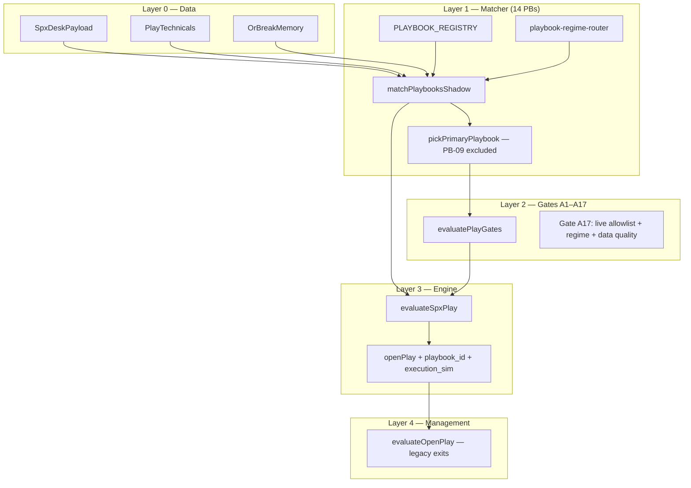

# SPX Playbook — Architecture & Status (Single Source of Truth)

**Repo:** `coreentryadmin-web/blackout-web-sandbox` → `https://staging.blackouttrades.com`  
**Last updated:** 2026-07-10  
**Scope:** Staging playbook lab only — do **not** merge to Railway prod `blackout-web` `main` unless explicitly requested.

This document consolidates architecture, implementation status, per-playbook fidelity, four setup families, what is fixed, what remains, validation tiers, and code map. Older docs (`PLAYBOOK-ARCHITECTURE-DEEP-DIVE.md`, `PLAYBOOK-IMPLEMENTATION-ROADMAP.md`, etc.) remain as detail appendices; **start here** for current truth.

---

## Table of contents

1. [Executive summary](#1-executive-summary)
2. [Architecture — layered decision stack](#2-architecture--layered-decision-stack)
3. [Four setup families](#3-four-setup-families)
4. [What changed from the old model](#4-what-changed-from-the-old-model)
5. [Runtime flow (today)](#5-runtime-flow-today)
6. [Per-playbook status matrix](#6-per-playbook-status-matrix)
7. [Shipped fixes (PR trail)](#7-shipped-fixes-pr-trail)
8. [Open gaps & phase plan](#8-open-gaps--phase-plan)
9. [Gates, flags, and live allowlist](#9-gates-flags-and-live-allowlist)
10. [Telemetry & evidence promotion](#10-telemetry--evidence-promotion)
11. [External assessment scores](#11-external-assessment-scores)
12. [ChatGPT Findings Addendum](#12-chatgpt-findings-addendum)
13. [Data & research requirements](#13-data--research-requirements)
14. [Instance schema — 20 required fields](#14-instance-schema--20-required-fields)
15. [Expectancy metrics (not win rate alone)](#15-expectancy-metrics-not-win-rate-alone)
16. [Hard constants — OOS validation bands](#16-hard-constants--oos-validation-bands)
17. [Code map](#17-code-map)
18. [Validation commands](#18-validation-commands)
19. [Related docs](#19-related-docs)

---

## 1. Executive summary

| Dimension | Status |
|-----------|--------|
| **Model** | Playbook-first BUY on staging (14 named setups PB-01…PB-14) replacing opaque confluence score |
| **Staging deploy** | Playbook lab **hardwired** via `isStagingDeploy()` — live gate always on |
| **Live allowlist** | PB-01, PB-02, PB-03, PB-04 only (`PLAYBOOK_LIVE_ALLOWLIST`) |
| **Prod Railway** | Legacy confluence BUY unless `PLAYBOOK_LIVE_GATE=1` (off) |
| **Primary selection** | FULL-SPEC §5 order minus PB-09 (HELIX modifier only) |
| **State machine** | Per-instance transitions with **invalidation**; still tick-recomputed matchers |
| **Evidence** | n=19 prod outcomes mined; autonomous prod BUY frozen until tier thresholds |

**Bottom line:** Staging is the evidence lab. Architecture is promising; **trading edge remains unproven**. Do not confuse explainability with profitability. Four families validate edge before per-PB label splits. PB-09 demoted. Unknown regime and severe data quality fail-closed on live BUY. MVP matchers stay shadow-only until promotion tiers met.

> **Critical takeaway:** Do not interpret the sophistication of the architecture as evidence that the strategy works. The architecture enables falsifiable hypotheses; profitability requires clean prospective evidence, execution realism, and risk controls.

---

## 2. Architecture — layered decision stack



### Layer responsibilities

| Layer | Owns | Does not own |
|-------|------|--------------|
| **Matcher** | Preconditions (ARM), triggers (FIRE), direction, session window, regime eligibility | Position sizing, exits |
| **Gates** | Session/risk vetoes, macro windows, halt, grade floors, **A17 playbook live gate** | Direction pick |
| **Engine** | BUY/SCANNING/WATCHING, confluence score (legacy), open play lifecycle | Per-PB invalidation after entry |
| **Management** | STOP/TARGET/TRIM/THESIS/THETA | Named setup identity on exit |

### Gate categories (post-hoc labels today)

`blocks_by_category` on `PlayGateResult`: `operational`, `risk`, `validity`, `quality`. Evaluation is still flat AND — **split evaluation order is phase 2**.

### Data quality modes (live gate)

| Mode | Condition | Live BUY effect |
|------|-----------|-----------------|
| `normal` | All feeds fresh | Standard per-PB rules |
| `degraded` | 1 issue (halt stale **or** desk stale **or** gex missing) | Event/breakout PBs blocked (PB-03,05,09,13,14) |
| `severe` | 2+ issues simultaneously | **Fail-closed** all live playbook BUY |

Global halt channel remains **fail-open** with warning in `spx-play-gates.ts` (confirmed live halt still blocks).

---

## 3. Four setup families

Validate **family edge first**, then test whether individual PB labels separate outcomes.

| Family | Playbooks | Role | Live allowlist today |
|--------|-----------|------|----------------------|
| **Trend continuation** | PB-03, PB-05, PB-06, PB-08, PB-10 | Breakouts, wall rides, power hour, EMA stack | PB-03 |
| **Mean reversion** | PB-02, PB-04, PB-07, PB-11 | VWAP reject, pin fade, max pain, chop scalp | PB-02, PB-04 |
| **Reversal / failure** | PB-01, PB-12, PB-13, PB-14 | VWAP reclaim, lotto reversal, gap fade, failed ORB | PB-01 |
| **Flow / event (modifier)** | PB-09 | HELIX surge — **never primary** | None |

Registry fields: `setup_family`, `fidelity` (`high` | `mvp`) on each `PlaybookDefinition` in `playbook-registry.ts`.

### Primary priority (FULL-SPEC §5 minus PB-09)

```
PB-13 → PB-14 → PB-03 → PB-05 → PB-06 → PB-04 → PB-07 → PB-08 → PB-01 → PB-02 → PB-10 → PB-11 → PB-12
(PB-09 never primary — flow modifier only)
```

Implemented in `playbook-primary-rank.ts` → `pickPrimaryPlaybook()`. Family fields drive `family_audit` telemetry rollup.

---

## 4. What changed from the old model

| Old (confluence) | New (playbook) |
|------------------|----------------|
| Scalar score + grade | Named setup with ARM/TRIGGER/INVALIDATION |
| Direction = sign(score) → long-only bias | Per-PB direction + short pipeline audit |
| "Factor soup" — no audit trail | `playbook_id` on open + shadow telemetry |
| Bought breakouts inside gamma pin | Regime router + family-aware primary |
| HELIX could dominate primary | PB-09 demoted to modifier |

**Evidence (prod n=19):** 31.6% win rate, grade did not predict, 18/19 entries in `mean_revert` γ at entry. See `PLAYBOOK-EVIDENCE-BASE.md`.

---

## 5. Runtime flow (today)

Every ~2s play poll on staging:

1. `buildPlayTechnicals(desk)` — OR, VWAP streaks, EMA9 curl, breakout flags
2. `matchPlaybooksShadow(desk, technicals, now, { or_break_memory })` — 14 verdicts
3. `pickPrimaryPlaybook(verdicts)` — excludes PB-09; family-grouped tie-break
4. `evaluatePlayGates(..., { playbook_primary_id, playbook_primary_direction })` — A17 on BUY
5. `buildPlaybookShadowPanel()` → API `playbook_shadow` with `pipeline_audit` + `family_audit`
6. `maybeLogPlaybookShadowMatch()` → Postgres + instance transitions
7. If gates pass + lab path → `openPlay()` with `playbook_id`, `execution_sim` on option ticket

### State machine (stub → P1)

| State | Meaning |
|-------|---------|
| `idle` | Window closed, regime ineligible, or no precondition |
| `armed` | `precondition_match` true |
| `triggered` | `trigger_fired` true |
| `invalidated` | Lost precondition after armed, or trigger dropped after fired |

`collectPlaybookInstanceTransitions()` uses `resolvePlaybookLifecycleState()` — persisted to `spx_playbook_instances` / shadow row `instance_transitions`.

**Still tick-recomputed:** matchers do not require prior armed duration or blocked-while-armed ordering (phase 2).

---

## 6. Per-playbook status matrix

| ID | Name | Family | Fidelity | Matcher | Live | Notes |
|----|------|--------|----------|---------|------|-------|
| PB-01 | VWAP Reclaim | reversal_failure | **high** | Strict `minutes_below_vwap >= 15` | ✅ allowlist | #61 |
| PB-02 | VWAP Reject | mean_reversion | **high** | Flow materiality ≥100k | ✅ allowlist | Not z-score/persistence yet |
| PB-03 | OR Breakout | trend_continuation | **high** | OR break + flow; static MTF buffer | ✅ allowlist | Buffer not VIX/OR-normalized |
| PB-04 | Gamma Pin Fade | mean_reversion | mvp | Wall proximity proxy | ✅ allowlist | Shadow-quality matcher |
| PB-05 | Wall Break Cont. | trend_continuation | mvp | Wall break, no VEX streak | ❌ shadow | Degraded-feed block on live |
| PB-06 | Flip Level Ride | trend_continuation | mvp | Flip break + EMA stack proxy | ❌ shadow | |
| PB-07 | Max Pain Gravitation | mean_reversion | mvp | Time + distance proxy | ❌ shadow | |
| PB-08 | Power Hour Mom. | trend_continuation | mvp | Net flow + micro-range | ❌ shadow | Parallel `spx-power-hour-engine` |
| PB-09 | HELIX Flow Surge | flow_event | mvp | HELIX tier + desk align | ❌ **never primary** | Modifier; degraded block if live |
| PB-10 | EMA Stack Pullback | trend_continuation | mvp | Uses `minutes_above_vwap` as EMA proxy | ❌ shadow | Needs real EMA stack fields |
| PB-11 | Range Chop Scalp | mean_reversion | **high** | Rolling 30m high/low | ❌ shadow | #61 |
| PB-12 | Lotto Reversal | reversal_failure | mvp | Session change % proxy | ❌ shadow | Parallel `spx-lotto-engine` |
| PB-13 | Gap Fade | reversal_failure | mvp | Gap + fail-to-extend | ❌ shadow | Degraded-feed block |
| PB-14 | Failed ORB Reversal | reversal_failure | **high** | OR break memory + re-entry | ❌ shadow | Memory #64; not on allowlist |

---

## 7. Shipped fixes (PR trail)

| PR | What shipped |
|----|--------------|
| **#59–60** | Deep-dive docs, external review response, promotion tiers |
| **#61** | PB-11 rolling 30m range; PB-01 strict 15m VWAP pre |
| **#62** | `PLAYBOOK_LIVE_ALLOWLIST` enforced at gate A17 |
| **#63** | State machine stub, pipeline audit, feature snapshot, unknown regime fail-closed, degraded feed PB blocks, PB-02 flow materiality, option sim stub |
| **#64** | Gate `blocks_by_category`, `execution_sim` on open, PB-14 OR break memory, validate `pipeline_audit` |
| **#66** | Research requirements + assessment scores in status doc |
| **This branch** | Instance events table, blocked-primary logging, full feature snapshot, counterfactual MFE/MAE, evidence report + param sweep scripts |
| **#69** (phase 2) | VIX/OR scaled buffers, armed-poll guards, session risk governor, playbook exit profiles, option exit sim, ECS auto-roll |
| **#70** (phase 3) | Full FSM open/managing/closed, Trade Governor, PB-01–04 exit engines, options P/L model, VolatilityContext, cron FSM sync |
| **#77** (promotion stats) | Session-aware promotion gates, robustness checks, counterfactual comparability filter, normalized-param roadmap |

---

## 8. Open gaps & phase plan

### Target architecture (vNext)

```
Market Data → Feature Engine → Regime Engine → Playbook Matcher
  → Playbook State Machine → Play Selection → Trade Governor
  → Execution Simulator → Position Manager → Exit Engine
  → Evidence Store → Analytics
```

**Policy:** No new playbooks or allowlist expansion until FSM + governor + options-aware outcomes are green on OOS data.

### P0 — Done on staging

- [x] Live allowlist gate A17
- [x] Instance id + transitions + feature snapshot
- [x] Pipeline audit (long/short + family rollup)
- [x] Unknown regime fail-closed (live)
- [x] Per-PB degraded feed blocks (event set)
- [x] PB-01/02/11/14 matcher hardening
- [x] PB-09 excluded from primary
- [x] Invalidation state transitions
- [x] Severe data quality global fail-closed

### P1 — Research infrastructure (shipped)

| Item | Status | Detail |
|------|--------|--------|
| `spx_playbook_instance_events` append-only | ✅ Shipped | Immutable snapshot per armed/triggered/invalidated/blocked/opened |
| Blocked-primary persistence | ✅ Shipped | `reason_blocked`, `executable=false`, blocked events |
| Counterfactual MFE/MAE | ✅ Shipped | Running max on triggered-not-opened instances |
| Expanded feature snapshot | ✅ Shipped | GEX walls, max pain, king, data_quality_mode |
| `first_block_category` on gates | ✅ Shipped | Layered gate telemetry |
| `npm run playbook:evidence-report` | ✅ Shipped | OOS-only SQL metrics |
| `npm run playbook:param-sweep` | ✅ Shipped | Stability bands, no in-sample tune |
| OOS train firewall in code | ✅ Shipped | `playbook-evidence-config.ts` |

### P1 — Phase 3 shipped (staging)

| Item | Status | Detail |
|------|--------|--------|
| Full instance FSM | ✅ Shipped | `idle→armed→triggered→open→managing→closed` + terminal freeze |
| Trigger latch + gate re-arm | ✅ Shipped | `playbook-state-machine.ts` — soft block → `armed` |
| Engine FSM commits | ✅ Shipped | `commitPlaybookInstanceOpen/Managing/Closed` on BUY/TRIM/SELL |
| Cron FSM telemetry | ✅ Shipped | `syncPlaybookTelemetryAfterEvaluate` in `runSpxEvaluator` |
| Trade Governor subsystem | ✅ Shipped | `trade-governor.ts` — session caps, spread/premium, VIX, revenge lock |
| Per-PB exit engines (PB-01–04) | ✅ Shipped | `playbook-exit-engines.ts` — bespoke invalidation + trim |
| Options P/L lite model | ✅ Shipped | `playbook-option-pnl.ts` — delta/gamma/theta + `greeks_snapshot` |
| VolatilityContext | ✅ Shipped | `playbook-volatility-context.ts` — scaled distance thresholds |

### P1 — Phase 2 shipped (staging)

| Item | Status | Detail |
|------|--------|--------|
| Armed duration guard (`PLAYBOOK_MIN_ARMED_POLLS`) | ✅ Shipped | `applyPlaybookVerdictGuards` + `armed_poll_count` column |
| PB-03 VIX/OR-normalized buffer | ✅ Shipped | `scaledPlaybookMtfBufferPts` / `scaledPlaybookStructureProximityPts` |
| Session risk (legacy) | ✅ Superseded | Merged into `trade-governor.ts` |
| Option exit cost model | ✅ Shipped | `simulateOptionExit` + `round_trip_cost_pts` on `execution_sim` |
| ECS auto-deploy after ECR push | ✅ Shipped | `force-new-deployment` in `ecr-push-staging.yml` |

### P1 — Still open

| Item | Status | Detail |
|------|--------|--------|
| Evidence-aware primary ranking (historical edge weight) | 🟡 Partial | Priority list only; no win-rate weight |
| Layered gate short-circuit evaluation | 🟡 Partial | `first_block_category` shipped; still flat AND |
| Dedicated Regime Engine object | 🟡 Partial | Still embedded in matcher eligibility |
| Full options path simulator (IV surface) | 🟡 Partial | Lite delta/gamma/theta only |
| Per-PB exit engines PB-05+ | ⏳ Blocked | PB-01–04 only until evidence tiers |
| PB-02 z-score / persistence | ⏳ Planned | Materiality only |
| PB-10 real EMA stack fields | ⏳ Planned | VWAP minutes proxy |
| MVP matcher hardening PB-04–08,10,12,13 | ⏳ Planned | Shadow-only until OOS evidence |
| Prospective OOS sample size | ⏳ Accumulating | Scripts ready; need RTH sessions on staging |

### P2 — Production discipline

| Item | Status |
|------|--------|
| Session risk governor | ✅ Shipped — per-PB cap + degraded size |
| Limited-live prod with min size | ❌ Blocked until evidence tiers |
| Autonomous prod BUY | ❌ Frozen |
| Expand beyond 14 playbooks | ❌ Frozen |

### P3 — Catalog hygiene

| Item | Status |
|------|--------|
| Typed registry → doc matrices CI check | ⏳ Planned |
| PB-14 allowlist expansion | ⏳ Blocked on evidence |
| Family-level outcome mining | ⏳ Planned (SQL on `playbook_id` + `setup_family`) |

---

## 9. Gates, flags, and live allowlist

### Staging (always on)

- `playbookStagingLabEnabled()` → `isStagingDeploy()` at Docker build
- `playbookLiveGateEnabled()` → true on staging
- Default allowlist: `PB-01,PB-02,PB-03,PB-04` (`PLAYBOOK_LIVE_ALLOWLIST_DEFAULT_STAGING`)
- Infra: `blackout-infra` `apply-staging-env-overrides.mjs` sets `PLAYBOOK_LIVE_ALLOWLIST`

### Gate A17 checklist (live BUY)

1. `playbook_primary_id` not null (fired primary, PB-09 excluded)
2. Primary in `PLAYBOOK_LIVE_ALLOWLIST`
3. Not `isUnknownPlaybookRegime(desk)`
4. Not `severe` data quality mode
5. Not `isDegradedForLivePlaybook(pbId, flags)` for event PBs
6. Direction aligns with staging lab path when applicable

### Prod

- Playbook live gate **off** unless `PLAYBOOK_LIVE_GATE=1`
- No autonomous BUY expansion without evidence sign-off

---

## 10. Telemetry & evidence promotion

### Tables

| Table | Content |
|-------|---------|
| `spx_playbook_shadow_observations` | Verdicts, `pipeline_audit`, `family_audit`, `feature_snapshot`, `instance_transitions` |
| `spx_playbook_instances` | Durable per-day per-PB state |
| `spx_open_play.playbook_id` | PB on entry |
| `spx_play_outcomes.playbook_id` | PB on close for joins |

### Promotion tiers — session-aware statistical gates (#77)

Trade count alone is **not** sufficient for 0DTE. Five triggers on one CPI day are **not** five independent samples. The unit of confidence includes **sessions** and **unique market conditions** (VIX quartile × gamma_regime × regime at trigger).

| Tier | Volume gates | Robustness gates (all required when tier applies) |
|------|--------------|---------------------------------------------------|
| **Research** | ≥30 triggers, ≥20 simulated opens, ≥8 sessions, ≥3 market-condition buckets | Accumulate OOS shadow; no expectancy promotion |
| **Staging-qualified** | ≥50 closed cost-adjusted trades, ≥15 sessions, ≥5 condition buckets | Positive **median OR 10% trimmed mean**; positive mean under **1.5× adverse slippage**; best-trade profit share ≤30%; best-session share ≤40%; **2/3 walk-forward** chronological windows positive; **p5 return ≥ −12 pts**; param bands in range (`playbook:param-sweep`) |
| **Limited-live** | ≥75 closed trades, ≥20 sessions, ≥6 condition buckets | Staging gates with tighter concentration (25% / 35%) and p5 ≥ −10 pts; **`full_v2` execution_sim** + per-trade quote reconciliation + risk governor |

Enforced in code: `playbook-promotion-requirements.ts`, `playbook-promotion-eval.ts`, `npm run playbook:evidence-report` (`promotion_tier`, `promotion_gates_failed`).

**Do not** enable prod autonomous BUY or expand allowlist without meeting tiers **including robustness gates**, not sample count alone.

#### Counterfactual comparability

Counterfactual MFE/MAE is only comparable across instances sharing the same `counterfactual_eval` contract (`contract_version=1`, same `counterfactual_horizon_seconds`, `reference=underlying_trigger_price`). The evidence report filters non-comparable rows before aggregating `median_counterfactual_*` — prevents mixing unlike horizons or references.

#### Independence / correlation policy

| Anti-pattern | Gate |
|--------------|------|
| 45/60 trades in one VIX regime | `min_unique_market_conditions` |
| Expectancy from 2 outlier winners | `max_best_trade_profit_share` + trimmed mean |
| One week drives all profit | `max_best_session_profit_share` + walk-forward |
| Edge disappears with worse fills | `positive_expectancy_adverse_slippage` |
| Long bull-market-only sample | walk-forward + condition buckets (full regime stratification planned) |

---

## 11. External assessment scores

Independent review (2026-07-10) — aligned with repo policy:

| Dimension | Score | Assessment |
|-----------|-------|------------|
| **Architecture** | 8/10 | Layered model, shadow rollout, named setups, state-machine direction, telemetry path are strong |
| **Strategy specification** | 6/10 | Thoughtful rules, but static thresholds, weak proxies, incomplete fields, overlapping playbooks |
| **Evidence quality** | 2/10 | n=19 prod trades, all long, negative avg P&L, no playbook-specific prospective sample |
| **Production readiness** | 3/10 | Appropriate for shadow/staging; not trusted autonomous 0DTE generation |
| **Potential** | 8/10 | Could become serious if next work is prospective evidence + execution realism + risk controls |

### ChatGPT addendum scorecard (post #67)

| Dimension | Score | Notes |
|-----------|-------|-------|
| **Engineering** | 8.5/10 | Signal engine → structural framework; telemetry + shadow path strong |
| **Research framework** | 9/10 | Instance events, OOS firewall, evidence report, blocked-setup logging |
| **Strategy maturity** | 5/10 | Rules exist; static thresholds, MVP matchers, edge unproven |
| **Production readiness** | 4/10 | Shadow/staging appropriate; not autonomous prod |

> Treat as a **research platform** until robust prospective evidence demonstrates durable expectancy.

---

## 12. ChatGPT Findings Addendum

**Source:** ChatGPT review of `PLAYBOOK-ARCHITECTURE-STATUS.md` (2026-07-10).  
**Verdict:** Architecture improved significantly — engineering direction is strong; **trading edge is not statistically proven**.

### Major improvements (agreed + shipped)

| Finding | Repo status |
|---------|-------------|
| Four playbook families reduce complexity | ✅ `setup_family` on registry + `family_audit` |
| PB-09 (HELIX) demoted — confirmation/modifier, not primary | ✅ `playbook-primary-rank.ts` |
| Unknown regime fail-closed on live BUY | ✅ Gate A17 |
| Immutable telemetry + shadow deployment | ✅ `spx_playbook_instance_events` + append-only snapshots |
| Staging limited to PB-01–PB-04 | ✅ `PLAYBOOK_LIVE_ALLOWLIST` |

### Remaining concerns (honest)

| Priority | Item | Status |
|----------|------|--------|
| **P0** | Full persistent state machine (not tick-recomputed) | 🟡 Armed-poll guard + `armed_poll_count`; not full blocked-while-armed |
| **P0** | Option-level execution modelling | 🟡 Entry + exit sim + `round_trip_cost_pts` at open |
| **P1** | Playbook-specific exits | ✅ `playbookExitProfile` in `evaluateOpenPlay` |
| **P1** | Volatility-aware thresholds (not static pts) | ✅ VIX/OR scaled buffers in matchers |
| **P1** | Session-level risk governor expansion | ✅ Per-PB trigger cap + degraded size multiplier |

### Research methodology (agreed policy)

1. Gather **larger prospective samples** (OOS from 2026-07-10+) — infrastructure ready, data accumulating  
2. **Separate hypothesis generation from validation** — n=19 = training only; `playbook:evidence-report` enforces OOS  
3. **Validate parameters out-of-sample** — `playbook:param-sweep` stability bands; no n=19 tuning  
4. Optimize for **expectancy**, not win rate — report script includes profit factor / expectancy  

### Production readiness statement

Appropriate for **shadow testing and staged validation** on `staging.blackouttrades.com`.  
**Not** ready for fully autonomous production trading until execution modelling, durable state semantics, and broader prospective evidence are complete.

**Staging deploy note:** `ecr-push-staging.yml` now triggers ECS `force-new-deployment` after each push to `:staging`. Manual roll only needed if the workflow is skipped.

```bash
aws ecs update-service --cluster blackout-staging-cluster \
  --service blackout-staging-web --force-new-deployment
```

### Recommended roadmap (ChatGPT order)

| Step | Item | Status |
|------|------|--------|
| 1 | Persistent state machine | 🟡 Armed-poll guard shipped |
| 2 | Option execution simulator | ✅ Entry + exit + round-trip cost |
| 3 | Playbook-specific exits | ✅ Shipped |
| 4 | Session risk governor | ✅ Shipped |
| 5 | Prospective evidence collection | ✅ Infra live; need RTH sessions |
| 6 | Threshold normalization (VIX/OR-aware) | ✅ Shipped in matchers |
| 7 | Expand playbooks beyond PB-01–04 | ❌ Blocked until evidence tiers |

---

## 13. Data & research requirements

ChatGPT research checklist (2026-07-10). **Implemented on staging** unless noted.

### 12.1 Capture every eligible setup — not only opens

| Capability | Status |
|------------|--------|
| Shadow observations on state change | ✅ `maybeLogPlaybookShadowMatch` |
| Per-PB verdicts every observation | ✅ `verdicts` JSONB |
| `pipeline_audit` funnel (long/short + family) | ✅ |
| `blocked_*` when gates veto primary | ✅ `pipeline_audit` + instance `reason_blocked` |
| Per-instance transitions | ✅ `spx_playbook_instance_events` |
| Counterfactual MFE/MAE for non-opens | ✅ `counterfactual_*_pts` on instance row |

### 12.2 Freeze feature values at decision time

| Field | Status |
|-------|--------|
| `PlaybookFeatureSnapshot` + `captured_at` | ✅ |
| GEX walls (top 8), max pain, gex_king | ✅ In snapshot |
| data_quality_mode + desk/halt/gex flags | ✅ |
| Per-transition immutable snapshot | ✅ Append-only `spx_playbook_instance_events` |
| Instance row latest snapshot | 🟡 Overwritten on update (events are source of truth) |

### 12.3 Separate hypothesis generation from validation

| Rule | Status |
|------|--------|
| n=19 = training/motivation only | ✅ Documented + `PLAYBOOK_TRAIN_CUTOFF_DATE` |
| OOS evidence from `2026-07-10+` | ✅ `PLAYBOOK_OOS_START_DATE` + evidence report SQL |
| Promotion tiers | ✅ Session + robustness gates (#77) |

### 12.4 Evaluate gates — blocked vs non-opened

| Signal | Status |
|--------|--------|
| `blocks_by_category` | ✅ |
| `first_block_category` | ✅ First failing layer |
| `gate_blocks` on shadow observations | ✅ |
| Blocked event per primary+fired+gate veto | ✅ Deduped via `spx_playbook_blocked_cursor` |

---

## 14. Instance schema

Target row per playbook instance (research contract):

| # | Field | Status | Where today |
|---|-------|--------|-------------|
| 1 | `session_date` | ✅ | `spx_playbook_instances` |
| 2 | `playbook_id` | ✅ | same |
| 3 | `instance_id` | ✅ | `{session}:{playbook_id}` |
| 4 | `armed_at` | ✅ | COALESCE on first armed |
| 5 | `triggered_at` | ✅ | COALESCE on first triggered |
| 6 | `invalidated_at` | ✅ | Set on invalidated transition |
| 7 | `opened_at` | ✅ | Patched on engine open |
| 8 | `closed_at` | 🟡 | Join `spx_play_outcomes` |
| 9 | `direction` | ✅ | instance row |
| 10 | regime snapshot | ✅ | `feature_snapshot` + events |
| 11 | input feature snapshot | ✅ | Full snapshot on each event |
| 12 | data-quality flags | ✅ | `data_quality_mode`, halt, desk, gex |
| 13 | reason armed | ✅ | event `reason` + `detail` |
| 14 | reason triggered | ✅ | event `reason` |
| 15 | reason blocked | ✅ | `reason_blocked` + blocked events |
| 16 | reason invalidated | ✅ | `reason_invalidated` |
| 17 | underlying entry reference | ✅ | `trigger_price` + `price_at_event` |
| 18 | option contract candidate | ✅ | `option_contract_candidate` on open |
| 19 | counterfactual MFE/MAE | ✅ | Instance row + blocked path |
| 20 | actual outcome | 🟡 | `spx_play_outcomes` join when opened |

**Coverage today: ~17/20 complete, ~2/20 partial (closed_at join, outcome when no open).**

---

## 15. Expectancy metrics

Per playbook (and per family), compute from **prospective OOS sample only**:

| Metric | Status |
|--------|--------|
| armed / triggered / executable counts | ✅ `playbook:evidence-report` |
| win rate, mean/median return | ✅ Report script (OOS SQL) |
| profit factor, expectancy | ✅ Report script |
| median MAE / MFE (closed) | ✅ Report script |
| median counterfactual MFE/MAE | ✅ Comparable-contract filter in report |
| promotion_tier + gates_failed | ✅ `playbook-promotion-eval.ts` |
| MFE capture %, tail loss, downside deviation | ⏳ Needs more closed OOS trades |
| time in trade | 🟡 On outcomes table |
| results after cost assumptions | 🟡 `execution_sim` at open |
| performance by VIX / gamma regime | ⏳ Extend report SQL |

> A 40% win-rate system can be excellent. A 60% win-rate system can lose money.

```bash
npm run playbook:evidence-report
npm run playbook:param-sweep
```

---

## 16. Hard constants

Several thresholds are **documented but lightly motivated**. Do **not** optimize each independently on n=19. Use **stability bands** — a real edge should survive 8↔12 pts proximity, not disappear at small moves.

| Constant | Default | Env override | Validation band (proposed) |
|----------|---------|--------------|----------------------------|
| Wall proximity | 10 pts | `SPX_PLAY_STRUCTURE_PROX_PTS` | 8–12 |
| MTF breakout buffer | 1 pt | `SPX_PLAY_MTF_BUFFER_PTS` | 0.5–2 |
| Wall stop offset | 3 pts | code | 2–4 |
| HELIX stop | 5 pts | code | 4–6 |
| Gap threshold (PB-13) | 0.3% | matcher | 0.25–0.35% |
| Range chop (PB-11) | 0.35% | matcher | 0.30–0.40% |
| RSI stretch (PB-12) | 72/28 | matcher | 70–74 / 26–30 |
| VWAP duration (PB-01) | 15 min | matcher | 12–18 min |
| Flow materiality (PB-02) | 100k | `PLAYBOOK_FLOW_MATERIALITY_MIN` | 75k–150k |

Implemented in `playbook-evidence-config.ts` + `npm run playbook:param-sweep`. **Bands are a first local perturbation check** — not full parameter validation. A playbook can pass 75k–150k flow materiality while still failing across VIX regimes or session periods.

**True validation** requires outcome stability across session periods, VIX regimes, flow distribution shifts, data vendors, and market-structure changes. Roadmap: `PLAYBOOK_NORMALIZED_PARAM_ROADMAP` in `playbook-evidence-config.ts` — replace absolute thresholds with normalized variables (e.g. flow vs session p95, wall proximity vs OR width, gap vs 30d median). VIX/OR-scaled buffers are **partial** (`playbook-volatility-scale.ts`).

---

## 17. Code map

| Module | Role |
|--------|------|
| `playbook-registry.ts` | PB-01…14 + `setup_family` + `fidelity` |
| `playbook-primary-rank.ts` | `pickPrimaryPlaybook`, `PLAYBOOK_PRIMARY_PRIORITY` |
| `playbook-regime-router.ts` | Regime eligibility + `isUnknownPlaybookRegime` |
| `playbook-shadow-matcher.ts` | 14 matchers → verdicts (VIX/OR scaled distances) |
| `playbook-match-resolver.ts` | Guarded match + armed polls + trigger counts |
| `playbook-volatility-scale.ts` | VIX/OR scaled buffer & proximity |
| `playbook-verdict-guard.ts` | Armed-poll guard + exit profiles |
| `playbook-session-risk.ts` | Per-PB session trigger cap + degraded size |
| `playbook-shadow-panel.ts` | API/UI snapshot |
| `playbook-shadow-log.ts` | Postgres telemetry |
| `playbook-pipeline-audit.ts` | Long/short funnel + `family_audit` |
| `playbook-state.ts` | Lifecycle + invalidation transitions |
| `playbook-data-quality.ts` | Flags + `liveDataQualityMode` |
| `playbook-break-memory.ts` | PB-14 OR break memory |
| `playbook-option-sim.ts` | `execution_sim` on option ticket |
| `playbook-gate-categories.ts` | Gate block category labels |
| `spx-play-gates.ts` | A1–A17 including playbook live gate |
| `spx-play-engine.ts` | `evaluateSpxPlay` integration |
| `playbook-evidence-config.ts` | OOS/train cutoffs + param bands + normalized-param roadmap |
| `playbook-promotion-requirements.ts` | Tier thresholds (sessions, conditions, concentration) |
| `playbook-promotion-eval.ts` | Robustness gates + `promotion_tier` evaluation |
| `playbook-market-condition-bucket.ts` | VIX×gamma×regime buckets for independence |
| `playbook-instance-events.ts` | Event builders + counterfactual math |
| `scripts/playbook-evidence-report.mjs` | OOS expectancy SQL report |
| `scripts/playbook-param-sweep.mjs` | Parameter stability bands |

---

## 18. Validation commands

```bash
# Local
npm test -- --test-name-pattern 'playbook'
npx tsc --noEmit
npm run lint:brand

# Staging (after ECS deploy)
npm run validate:staging-playbook
npm run playbook:evidence-report
npm run playbook:param-sweep
```

Expected staging playbook validate:

- `playbook_shadow.mode === "live"`
- 14 verdicts
- `pipeline_audit` present (includes `family_audit`)
- Primary never PB-09 when other PBs fire

---

## 19. Related docs

| Doc | Use when |
|-----|----------|
| `PLAYBOOK-FULL-SPEC-v2.md` | Field-level PB rules, gates A1–A17 |
| `PLAYBOOK-EVIDENCE-BASE.md` | Prod SQL mining, why we changed |
| `PLAYBOOK-EXTERNAL-REVIEW-2026-07-10.md` | ChatGPT + Claude review response |
| `PLAYBOOK-ARCHITECTURE-DEEP-DIVE.md` | Long narrative + UI surfaces |
| `PLAYBOOK-E2E-FOUNDATION.md` | Mermaid rollout phases |
| `PLAYBOOK-CTO-BRIEF-2026-07-10.md` | Executive RTH snapshot |
| `PLAYBOOK-IMPLEMENTATION-ROADMAP.md` | Short tracker (points here) |

---

*Last updated:* 2026-07-11 (session-aware promotion gates + parameter validation roadmap)
