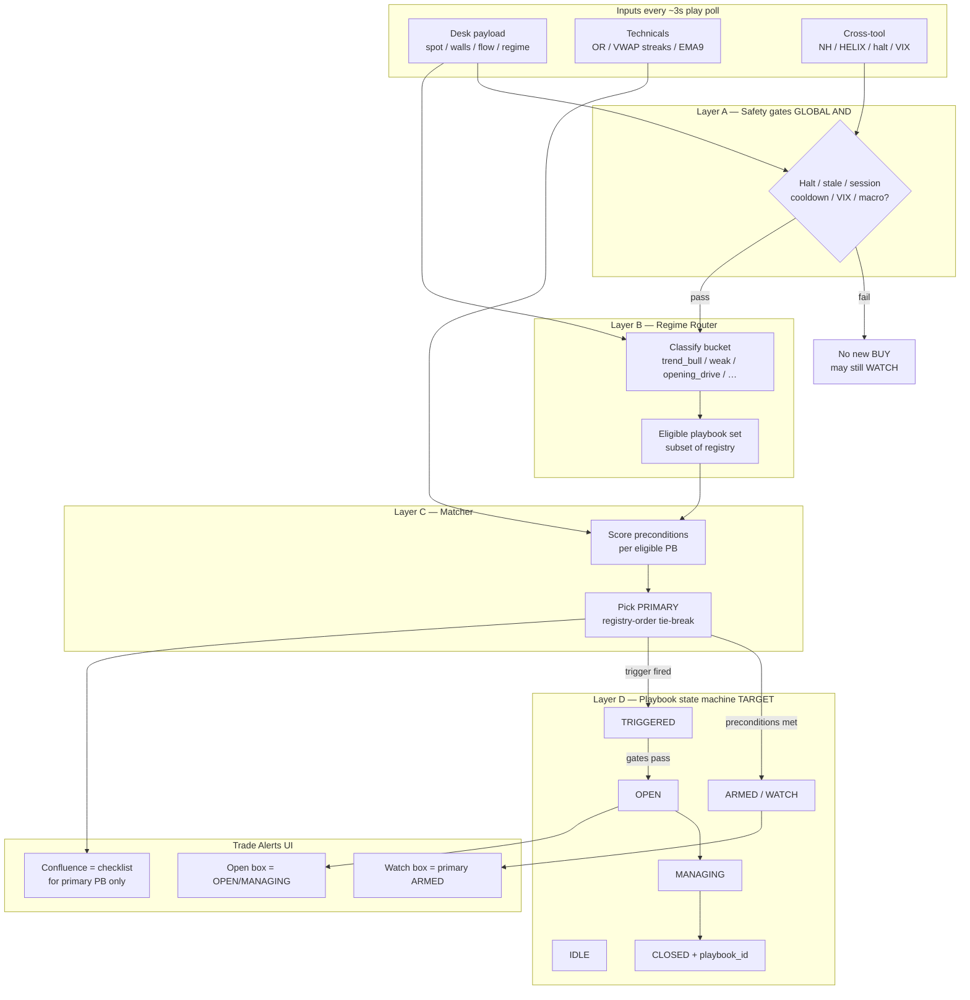
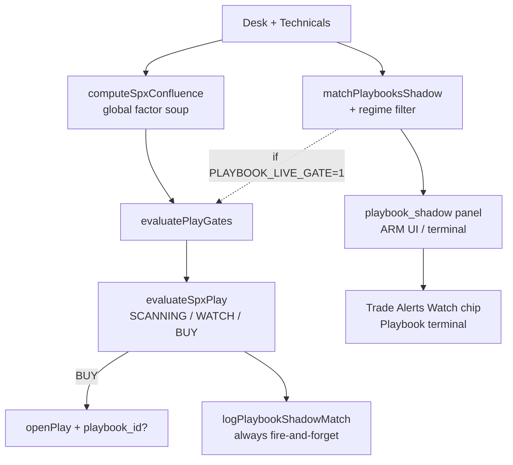
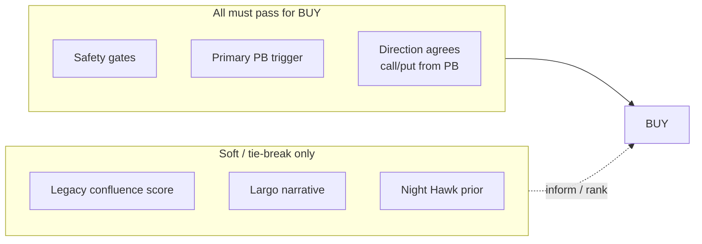
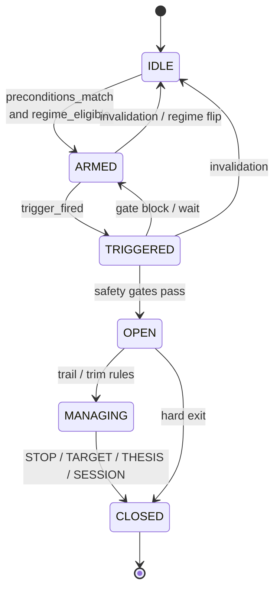
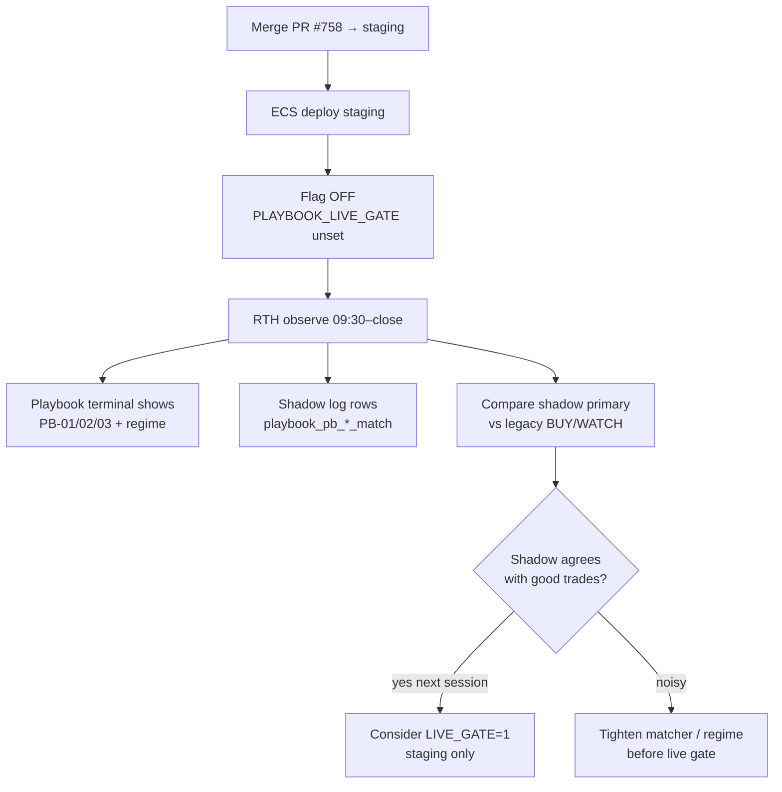
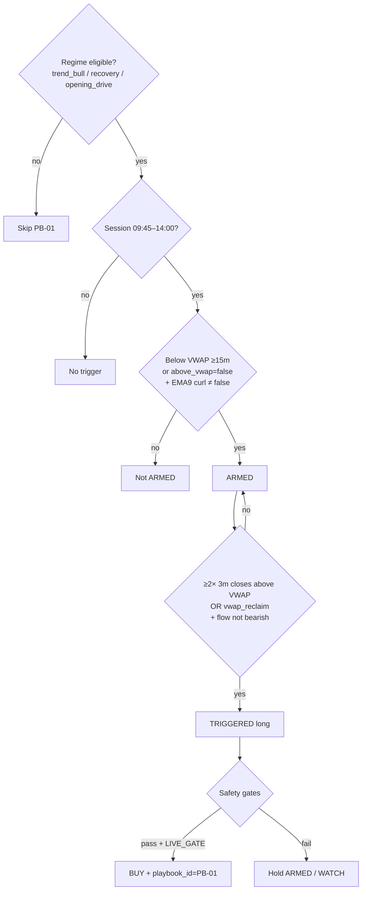

# SPX Slayer — Playbook End-to-End Foundation

**Status:** Target architecture designed; **hybrid on staging** (14 shadow matchers; full fidelity on PB-01–04, 08).  
**Staging policy:** playbook live gate **always on** when `isStagingDeploy()` — not env-toggleable.  
**Narrative deep dive:** `docs/spx/PLAYBOOK-ARCHITECTURE-DEEP-DIVE.md`  
**Rule-level spec:** `docs/spx/PLAYBOOK-FULL-SPEC-v2.md`  
**This file:** flowcharts + build vs gap map for agents and RTH validation.

---

## 1. Honest answer: is it fully designed end-to-end?

| Layer | Designed? | Built? | Notes |
|-------|-----------|--------|-------|
| Named playbooks PB-01…14 | Yes | Yes (shadow matchers all 14; full fidelity 01–04, 08) | Registry + matcher |
| Regime Router | Yes | Yes (MVP) | `playbook-regime-router.ts` |
| Matcher (preconditions / trigger) | Yes | Yes (bar-fidelity MVP) | OR / VWAP streaks / EMA9 |
| Safety gates (halt, stale, session…) | Yes (as-built) | Yes | Still global AND |
| **Play state machine** IDLE→ARMED→… | Yes | **No** | Still legacy SCANNING/WATCH/BUY |
| **Playbook-only confluence checklist** | Yes | **No** | Still global factor soup |
| BUY = playbook trigger | Yes | **Flagged** | `PLAYBOOK_LIVE_GATE=1` (default off) |
| `playbook_id` on outcomes | Yes | Yes (column) | Needs RTH volume to prove |
| Watch key = playbook instance | Yes | **No** | Still `0dte:{dir}:{date}` |
| Largo narrates playbook | Partial | Partial | Intel edges in; not full PB state |
| Kill lotto / power as parallel BUY | Open decision | No | Still parallel paths |

**Verdict:** The *target* end-to-end flow is designed. The *running* system is still **hybrid**: legacy confluence BUY + shadow/ARM playbook overlay. Full playbook-first E2E = state machine + checklist + live gate on by default.

---

## 2. Target E2E (foundation) — one tick



**Primary selection:** explicit `PRIMARY_PRIORITY` in `playbook-shadow-matcher.ts` (FULL-SPEC §5) — not registry array order.

**Decision rule (target):**

```text
BUY  ⇔  primary_playbook.trigger_fired
      AND  safety_gates.pass
      AND  (optional) playbook checklist OK

NOT:  confluence_score >= threshold alone
```

---

## 3. As-built today (hybrid) — what actually runs



**Key gap:** state machine and playbook checklist are **not** driving the engine yet. Shadow tells you what *would* be primary; legacy score still owns BUY unless the live flag is on.

---

## 4. Layered decision model (AND / OR)



- **Calls vs puts:** not separate playbooks. Direction is an **output** of the matched playbook (PB-01 reclaim→long, reject→short, etc.).
- **Confluence:** target = checklist for *active* PB only (AND of that PB’s remaining conditions). Today = weighted soup (OR-ish additive).

---

## 5. Playbook state machine (target)



**UI mapping**

| State | Box |
|-------|-----|
| ARMED | Watch |
| OPEN / MANAGING | Open |
| CLOSED | Track record / telemetry |

---

## 6. Friday RTH validation path (today)



**Do not** turn on `PLAYBOOK_LIVE_GATE` on prod Friday. Staging shadow-first is the foundation test.

---

## 7. Build order (foundation → complete E2E)

```mermaid
flowchart LR
  P1[Phase 1 Shadow matcher] --> P2[Phase 2 ARM UI]
  P2 --> P2b[Matcher fidelity + regime]
  P2b --> P3[Phase 3 LIVE_GATE flag]
  P3 --> P4[playbook_id telemetry]
  P4 --> P5[State machine module]
  P5 --> P6[PB checklist replaces soup]
  P6 --> P7[Watch key = PB instance]
  P7 --> P8[PB-04…12 evidence-gated]
```



| Phase | Done? |
|-------|-------|
| 1 Shadow | Yes |
| 2 ARM UI | Yes |
| 2b Fidelity + regime | Yes (#758) |
| 3 Live gate flag | Yes (off by default) |
| 4 playbook_id column | Yes |
| 5 State machine | **Next foundation gap** |
| 6 Checklist confluence | Open |
| 7 Watch key | Open |
| 8 PB evidence per-PB promotion | Open (shadow accumulating) |

---

## 8. Single-playbook example (PB-01 VWAP Reclaim)



---

## Related code

- Registry: `src/features/spx/lib/playbook-registry.ts`
- Regime: `src/features/spx/lib/playbook-regime-router.ts`
- Matcher: `src/features/spx/lib/playbook-shadow-matcher.ts`
- Panel / ARM: `src/features/spx/lib/playbook-shadow-panel.ts`
- Live flag: `playbookLiveGateEnabled()` in `spx-play-config.ts`
- Gate hook: `evaluatePlayGates` + `evaluateFlatPlay` in engine
